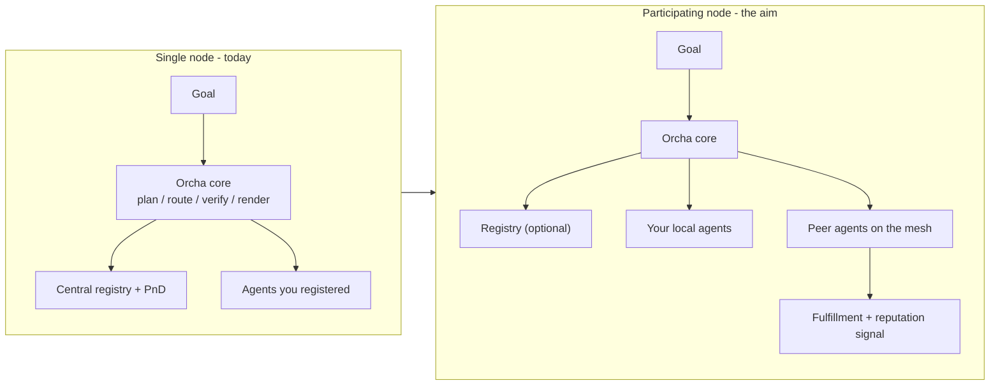

# Orcha — Product Vision

> **What this document is.** The product bet behind Orcha: who it is for, what each user
> actually does, why network participation changes the product, what we aim for if a
> network layer is added, where the idea comes from, and how we stand against the
> harnesses, orchestration systems, and personal-assistant runtimes already in the field.
>
> **What it is not.** It is not the engineering spec ([`docs/srs.md`](docs/srs.md) is the
> as-built truth). This sits above it: the honest product layer that says what we are
> building now and what we are building toward.

---

## 1. The thesis in one line

**Orcha turns one natural-language goal into a multi-protocol agent run with verified steps
and a live dashboard — not a chat reply.**

There are two products in one repository, and it matters that you keep them separate:

| | What it is | Status |
|---|---|---|
| **The runtime (v1)** | An open orchestration harness: plan a goal into an agent DAG, route each step to its protocol handler, verify output, render a dashboard. Runs fully local, mock-payable, no closed dependency. | Shipping |
| **The network layer (aim)** | A peer-participation layer on the runtime — broader discovery, shared fulfillment signals, reputation, settlement. | Gated, earned phase by phase |

Everything below is written so that the runtime stands on its own merits **today**, and the
network is a second act we earn — not a promise we front-load.

- Internals: [`docs/srs.md`](docs/srs.md)
- Phased trajectory and gates: [`ROADMAP.md`](ROADMAP.md)

---

## 2. Where the idea comes from

Four forces converged to make this the right thing to build now.

**1. Protocols standardized, composition did not.** MCP (Anthropic) and A2A (Google) landed
with real ecosystem adoption in 2025–26, and legacy systems with no API can still be driven
via computer-use. But every serious agent stack now speaks *several* of these at once. The
loop that coordinates them across protocol boundaries — in a single goal-driven run — has no
open-source solution. Agents are islands; the glue code between them is where projects drown.

**2. The bottleneck moved to the verifier, not the model.** The "loop engineering" discourse
made the point publicly: in any agent loop, the verifier is the constraint, not the model.
Single-agent looping tools solve one agent on one task. The unsolved problem is *multi-agent
composition with structured, verifiable output* — which is exactly the layer Orcha owns.

**3. Structured output beats evaporating text.** A chat bubble is thrown away the moment you
scroll. Orcha agents return a declarative UI manifest (**CanvasKit**) that the runtime renders
as metric cards, charts, tables, and alert feeds — output that persists and can be checked.

**4. Orchestration is the precondition for a network.** You cannot build an agent
network before proving agents can be orchestrated reliably and that there is demand for their
capabilities. Orcha is the foundation layer that proves both. We
summarize what a network layer would add in Section 5.

**Category, stated plainly.** Orcha is, in engineering terms, an **agent harness**: it does not
embody a single-purpose agent. It provides the plan → route → dispatch → verify → normalize →
render scaffolding that runs *other* agents reliably across protocols (see
[`docs/srs.md`](docs/srs.md) §2.1). The agents stay external and independent; Orcha is the
neutral ground between them.

---

## 3. Actors — what each user actually does

Orcha has distinct user classes, and each one gets a different job. The table shows what they
do today (local or in the hosted sandbox) and what changes once a network layer exists.

| Actor | Today (local / sandbox) | With network participation |
|---|---|---|
| **End user / operator** | Submits a goal, watches the run stream live (SSE), reads the CanvasKit dashboard, approves human-in-the-loop interrupts (auth, destructive actions, payments) | Discovers and runs agents beyond their own machine; routing becomes reputation- and cost-aware |
| **Guest** | Sandbox-only, no signup, a capped number of messages — a try-it surface | Unchanged: still a demo surface, deliberately *not* a personal assistant |
| **Agent developer** | Scaffolds an agent with the `emerge` SDK (`init` / `run` / `publish`), registers a versioned `emerge.yaml` manifest, gets orchestrated | Publishes into a peer mesh; opts into gossip via `network.experimental` and becomes a network participant while staying a valid A2A agent |
| **External agent** | An MCP / A2A / ACP / COMPUTER_USE server invoked during a run; may drive its own OAuth | Discovered by peers directly; its fulfillments are recorded through the `ExecutionObserver` seam |
| **Platform operator** | Runs the stack (`run-all.sh` or sandbox compose), sets model keys and spend caps, deploys the sandbox | Runs bootstrap nodes, manages graduation gates and experimental flags |

**Three playbooks, concretely:**

- **The operator** types *"summarize this company, update my storefront, and post to social"* and
  gets a dashboard where each step is marked verified or unverified — with pauses for approval
  where it matters. They never wrote glue code between the agents.
- **The agent developer** wraps an existing Python function in `@emerge.agent`, runs `emerge run`,
  and their agent is immediately discoverable and composable inside anyone's goal — no rewrite,
  no bespoke integration.
- **The contributor** writes a *bridge* — one protocol handler — and unlocks an entire ecosystem
  of agents that speak a protocol Orcha did not support yesterday.

**One clarification that prevents a common misread:** the hosted sandbox is a *trial deployment
of the same core*, with guest limits and spend caps. It is **not** a personal-assistant product.
"Run your own agents, pick your own model, on top of the Orcha core" is the story of the
**self-hosted runtime** — the sandbox is just its public demo with brakes on.

---

## 4. How network participation makes this different

This is the hinge of the whole product. A single Orcha node is already useful. A *participating*
node is a different category of thing.



**Today (single node):** discovery runs against a central Registry and PnD's vector index. You
can only compose agents you (or your operator) registered or seeded. Value is bounded by your
own fleet.

**With participation:** agents discover each other over a gossip mesh, share fulfillment signals,
and — in later phases — a knowledge commons and trust fabric. The central registry becomes
optional, then redundant. Crucially, the value that accrues here **cannot be copied as source
code**: the registered-agent graph, the reputation history, and the shared knowledge only exist
because agents are transacting on a live network. A fork can clone every line of the planner and
verifier and still start with zero agents, zero reputation, and zero accumulated knowledge.

**This is also the growth model.** The system expands at its edges without diluting its core:

| Zone | Who moves it | Effect |
|---|---|---|
| **Bridges, agents, CanvasKit components** | Community, no prior discussion needed | More protocols, more agents, more output types — network reach grows |
| **Core engine (planner, pipeline, registry contract)** | Maintainers, issue-first | Reliability improves without contract thrash |
| **`emerge.yaml` spec and other contracts** | RFC governance only | The shared standard stays stable — breaking it breaks everyone |

More registered agents make discovery more valuable for the next goal author, which makes
registering more valuable for the next agent builder. That two-sided flywheel — not lines of
code — is the durable advantage.

---

## 5. What we aim for if a network layer is added

A peer-participation network layer is an
**aim**, not a shipped feature set. It is deliberately gated: no capability graduates to a stable
default until the previous one is validated by real adoption. The single most important gate is
blunt: **no network engineering becomes the default before at least one external agent
registers in the wild.**

The runtime is already shaped so this layer can attach without a rewrite. The proof is a single
seam that exists in the code today:

```python
# services/superagent/src/superagent/middleware/observers.py
class ExecutionObserver(Protocol):
    async def on_step_complete(self, record: StepResult) -> None: ...
```

Every agent step passes through this observer after output normalization. The OSS build ships a
`NoOpObserver`; the network build swaps in a `FulfillmentRecorder`. That is the whole point — the
network is an injection, not a re-architecture.

What each capability is *aiming* to achieve (phased trajectory in
[`ROADMAP.md`](ROADMAP.md); existing code seams only in [`docs/srs.md`](docs/srs.md) §8):

| Capability | Aim |
|---|---|
| **Peer discovery** | Agents discover each other beyond a single central registry |
| **Observer attestations** | Fulfillment recorded via the `ExecutionObserver` observer seam |
| **Shared operational knowledge** | A persistent, queryable commons of what agents have learned |
| **Trust & settlement** | Verifiable fulfillment history and value settlement when usage is large enough to demand it |

**Explicit near-term non-goals** (so the vision does not get mistaken for a shipping claim):

- No default-on token, staking, or on-chain settlement in the current product.
- No GNN / ML ranking presented as a launch capability — discovery today is vector + gate logic.
- No claim that a production decentralized network exists today. It does not. Seams do.

---

## 6. Competitive analysis and advantage

Orcha sits at an intersection that no single incumbent occupies. The honest way to show that is
to say where each category *beats us* and where we win.

### Personal-assistant runtimes (OpenClaw and the like)

- **They win:** a personal, always-on assistant for one user; messaging channels; persistent
  personal memory; polished bring-your-own-model UX; a huge head start on community skills.
- **Orcha wins:** composing *many heterogeneous agents* across protocols in one goal-driven run;
  an open registry third parties publish to; structured CanvasKit output; human-in-the-loop auth,
  approval, and payment interrupts as first-class orchestration primitives.
- **Positioning:** OpenClaw is "my assistant engine." Orcha is "the orchestration engine for many
  agents." Same *category* — an open runtime you own — different *job*.

### Agent frameworks / harnesses (LangGraph, CrewAI, AutoGen)

- **They win:** ergonomic libraries for building an agent loop inside one process or framework.
- **Orcha wins:** real cross-protocol routing to independently running agent *services*, an open
  registry, and a planner + verifier + dashboard contract that is a product surface, not a
  library. These frameworks are what an agent is *built with*; Orcha is what agents are *composed
  in*.

### Workflow engines (Temporal, n8n, Zapier)

- **They win:** durable execution, mature operational visibility, human-wired DAGs, SLA culture.
- **Orcha wins:** AI-native goal decomposition and agent-protocol routing. We are explicitly **not**
  a Temporal replacement; for years we will look less mature on ops and more interesting only where
  agents, protocols, verification, and structured UI matter together.

### Cloud agent builders (Bedrock AgentCore, Vertex Agent Builder, lab-managed agents)

- **They win:** deep integration inside one vendor's cloud and model family.
- **Orcha wins:** neutrality. A runtime is cloud-agnostic and self-hostable; the model labs make
  the *workers*, and each is structurally disincentivized to build neutral ground that routes to a
  competitor's agents. Orcha is that neutral ground.

### Closest architectural cousin (Traycer)

- Same architecture thesis — plan → orchestrate → verify → ship, bring-your-own-agent — but
  verticalized to coding agents and assuming **homogeneous** local CLI tools running as processes.
- Orcha routes across **heterogeneous** protocols to independently running agent *services*, emits
  structured non-code output, and opens a registry anyone can publish to. A process wrapper versus
  a service mesh. Notably, Traycer keeps its coordination host closed; Orcha keeps the entire
  runtime Apache 2.0 and bets on network effects rather than a closed binary as the moat.

### Positioning matrix

| Capability | Orcha | OpenClaw-style | LangGraph/CrewAI | Temporal/n8n | Cloud builders |
|---|---|---|---|---|---|
| Multi-protocol routing (MCP + A2A + computer-use) | Yes | No | Partial | No | Vendor-bound |
| Open registry of third-party agents | Yes | No (skills) | No | No | Vendor catalog |
| Structured UI output (CanvasKit) | Yes | Canvas (personal) | No | No | Limited |
| Personal channels + persistent memory | No | Yes | No | No | Varies |
| Network / reputation layer (aim) | Yes (gated) | No | No | No | No |
| Self-hostable, fully OSS runtime | Yes | Yes | Yes (lib) | Partial | No |

The row that no competitor fills, and that we are built to own, is **multi-protocol composition +
open registry + structured output**, with the network layer as the compounding second act.

---

## 7. The near-term product bet

Vision is cheap without a feasible next step. Ours is deliberately narrow.

- **Ship credibility, not ambition.** The immediate product is the v1 runtime plus **harness
  reliability (v1.2)** — DAG execution, output verification and semantic judging, retry and
  fallback policies, long-task context. This is what makes blackbox-LLM runs fail loudly and
  recover predictably. It comes *before* any network ML or decentralization work.
- **Grow at the edges, freeze the core.** Bridges, agents, and CanvasKit components are the
  community growth engine; the execution pipeline and `emerge.yaml` spec change only through issue
  and RFC. See [`CONTRIBUTING.md`](CONTRIBUTING.md).
- **Measure the right signals.** Success in the first window is external agents registered, bridge
  contributions merged, and repeatable demos — not year-one revenue. This will not scale like a
  typical B2B product, and that is expected: it is infrastructure and a protocol, adopted slowly
  and developer-first.
- **Stay honest.** Payments are mock by default; ACP is accepted at the API layer and routed as
  A2A at runtime; the decentralized network is seams, not a live system. The product wins by being
  the thing it actually is.

---

## Document map

| Read this | For |
|---|---|
| [`docs/srs.md`](docs/srs.md) | As-built architecture, data model, interfaces (engineering truth) |
| [`ROADMAP.md`](ROADMAP.md) | Phases and adoption gates |
| [`docs/join.md`](docs/join.md) | The contributor journey |
| [`CONTRIBUTING.md`](CONTRIBUTING.md) | Contribution zones and ground rules |
