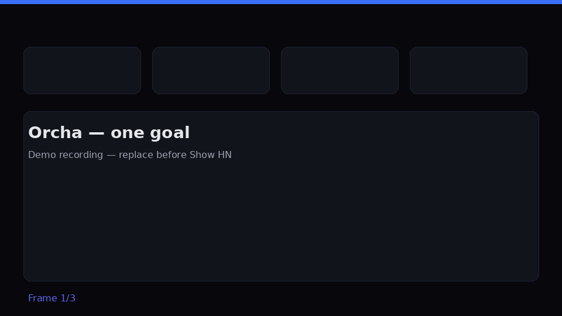

<div align="center">


**One goal. Many agents. Any protocol.**

*The open-source runtime for multi-protocol AI agent orchestration.*

[](https://github.com/azank1/orcha/actions)
[](https://securityscorecards.dev/viewer/?uri=github.com/azank1/orcha)
[](LICENSE)
[](https://python.org)
[](https://discord.gg/orcha)

</div>

---



## The problem

AI agents today are islands. MCP servers live here. A2A agents live there. Glue code everywhere.

Today's "loop engineering" tools handle one agent looping on one task. The harder problem — composing agents that speak **different protocols** into a single verified run with structured output — has no open-source solution.

**This is not a model problem. It's an orchestration, observability, and distribution problem.**

Orcha is the runtime that fixes it: one natural-language goal gets planned, routed, and executed across agents speaking **different** protocols in the same run — with a credential vault, auth cascade, output normalization, and per-call payments (mock mode by default, no wallet needed).

## See it work

Type a goal → Orcha discovers agents → composes MCP, A2A, and COMPUTER_USE in one run → renders a **[CanvasKit](docs/dev_docs/primitives/canvaskit.md) dashboard**, not a chat reply.

| Chat reply (before) | CanvasKit dashboard (Orcha) |
|---------------------|----------------------------|
| Prose summary you scroll past | Metric cards, charts, tables, alerts — live UI |

**Try it:** run the [hosted sandbox](deploy/sandbox/README.md) locally (`make -f deploy/sandbox/Makefile up`) or clone and `./scripts/run-all.sh`. Demo portfolio data is illustrative — no brokerage connection required.

**Hero goal (3-protocol demo):** *"Show me my portfolio performance, use your web scraper agent to summarize https://en.wikipedia.org/wiki/Nvidia, and screenshot the Alpaca dashboard"* → finance MCP + web-scraper A2A + mock computer-use in one run. Verified live, 5/5 runs, best wall clock 13s — see [docs/dev_docs/M0-VERIFICATION.md](docs/dev_docs/M0-VERIFICATION.md).

## Register an agent in 4 lines

> Orcha ships the **`emerge` SDK** for agent registration — `emerge init` scaffolds your agent manifest, `emerge register` publishes it to the runtime. No clone required: `uvx emerge init my-agent`.

```python
import emerge

@emerge.agent(name="My Agent", description="What I do")
def handle(task: str) -> str:
    return f"handled: {task}"
```

```bash
emerge run     # serve locally and register with the runtime
```

## Quickstart

Just building an agent? Zero clone:

```bash
uvx emerge init my-agent && cd my-agent && uvx emerge run
```

Running the full runtime (registry, planner, orchestrator, dashboard):

```bash
git clone https://github.com/azank1/orcha && cd orcha
./scripts/run-all.sh        # infra + all services + seed agents
```

Full setup: [docs/quickstart.md](docs/quickstart.md) · [docs/join.md](docs/join.md)

**Prove it yourself:** `./scripts/poc-e2e.sh` — one script registers a paid agent via the `emerge` SDK, runs a multi-protocol goal, and asserts verification, retry, and settlement end-to-end. Details: [docs/dev_docs/POC.md](docs/dev_docs/POC.md)

## Architecture

```
Goal
 └─► Registry ──► Planning & Discovery ──► SuperAgent
                                               │
                         ┌─────────────────────┼─────────────────────┐
                         ▼                     ▼                     ▼
                   MCP handler           A2A handler          COMPUTER_USE handler
```

(`protocol.type: "acp"` is still accepted in `emerge.yaml` and routes through
the A2A handler — a compatibility alias, not a fourth independently-bridged
protocol; see [docs/protocols.md](docs/protocols.md).)

<details>
<summary>Service map</summary>

| Service | Port | Role |
|---------|------|------|
| Registry | 8000 | Agent registration + gRPC |
| Planning & Discovery | 8001 | Vector search + LLM planner |
| SuperAgent | 8002 | LangGraph orchestration engine |
| Gateway | 8080 | Auth + BFF + mock payments |
| Frontend | 3000 | React chat UI |

</details>

## Contribute

| What | Where | Why it matters |
|------|-------|----------------|
| **New bridge** | `templates/your-first-bridge/` | Adds a protocol — highest leverage contribution |
| **New agent** | `agents/` | Grows the fleet, stress-tests the runtime |
| **CanvasKit component** | `frontend/src/components/canvas/` | New dashboard primitives for agent output |

→ [CONTRIBUTING.md](CONTRIBUTING.md) · [Write a bridge](docs/bridges.md) · [Open a RFC](https://github.com/azank1/orcha/issues/new?labels=rfc)

## What's next

**Harness reliability (v1.2)**, then a decentralized agent network (DAN) — full trajectory in [ROADMAP.md](ROADMAP.md). Vision essay: [INCEPTION.md](INCEPTION.md).

---

<div align="center">Apache 2.0 · <a href="https://discord.gg/orcha">Discord</a> · <a href="ROADMAP.md">Roadmap</a></div>
