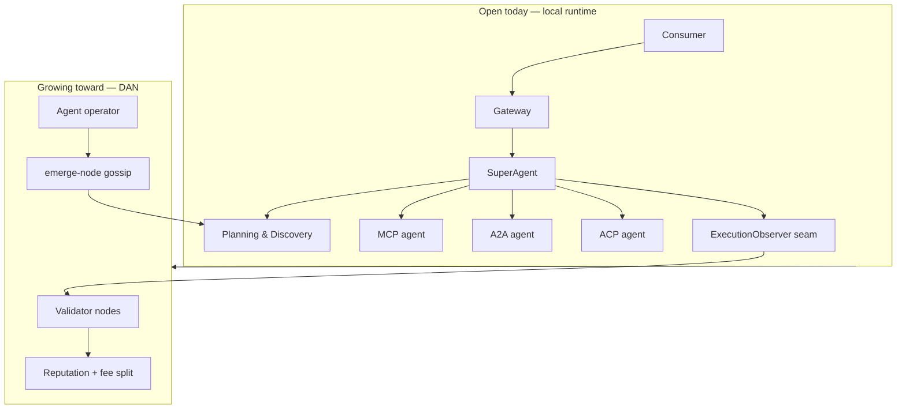
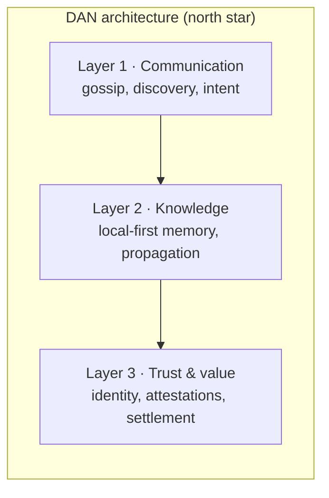

<p align="center">
  
</p>

<h1 align="center">Orcha</h1>

<p align="center">
  <strong>The open runtime for agent orchestration — growing into the Decentralized Agent Network (DAN).</strong><br/>
  Not a better model. A better way to <em>use</em>, <em>route</em>, <em>observe</em>, and <em>distribute</em> agents.
</p>

<p align="center">
  <a href="docs/quickstart.md">Quickstart</a> ·
  <a href="docs/join.md">Join</a> ·
  <a href="VISION.md">Vision</a> ·
  <a href="ROADMAP.md">Roadmap</a> ·
  <a href="CONTRIBUTING.md">Contribute</a>
</p>

---

## The problem we actually solve

Everyone is racing on **models**. The bottleneck is everything around them:

| Gap | What breaks today | What Orcha / DAN builds |
|---|---|---|
| **Passivity** | Agents wait for a human ping | Orchestration + (later) autonomous loops |
| **Isolation** | You wire every integration by hand | Discovery, gossip, federated registry |
| **Amnesia** | Every call starts from zero | Shared execution + knowledge propagation |
| **Economic sterility** | Agents can't earn or stake reputation | Per-call settlement, validator attestations |
| **Muteness** | No way to advertise capability at scale | Signed manifests, reputation, open observability |

**Orcha is the substrate:** one goal → plan → route → execute across **MCP, A2A, and ACP** in a single run, with validation, auth, payments (mock by default), and an **ExecutionObserver** seam for distributed attestation.

**DAN is the destination:** agents as network participants — not functions hidden behind a platform API.

> Full thesis: [`docs/dev_docs/EmergeOS-DAN.pdf`](docs/dev_docs/EmergeOS-DAN.pdf) · Public summary: [`VISION.md`](VISION.md)

---

## How it fits together





We ship **honestly**: trusted-coordinator bootstrap first, chain/token only when the network outgrows a single operator. See [`ROADMAP.md`](ROADMAP.md).

---

## Ship an agent in 3 lines

```python
import emerge

@emerge.agent(name="My Agent", description="What I do")
def handle(task: str) -> str:
    return f"handled: {task}"
```

```bash
emerge run    # serve + register locally
```

Every agent gets a DID, manifest ([`emerge.yaml`](docs/emerge-yaml.md)), transport, auth, and pricing — the passport for both local orchestration and future network participation.

---

## Who participates

| Role | You run | Today | DAN target |
|---|---|---|---|
| **Agent operator** | Your agent + `emerge` | Local registry | Signed gossip manifest · earn per call |
| **Coordinator** | Registry · PnD · SuperAgent · Gateway | `./scripts/run-all.sh` | Federated bootstrap |
| **Validator** | Observer on executions | `emerge validate --once` spike | Attest quality · earn fee share |
| **Consumer** | UI or CLI session | Mock credits | Pay · choose by reputation |

---

## Try it locally (~5 min)

```bash
git clone git@github.com:azank1/orcha.git && cd orcha
make install && cp services/superagent/.env.example services/superagent/.env
# add OPENROUTER_API_KEY to services/superagent/.env
./scripts/run-all.sh
emerge init demo && cd demo && emerge run
```

→ **[Full quickstart](docs/quickstart.md)** · **[Manual service setup](docs/setup.md)** for contributors

---

## Why contribute here

- **Bridges & agents** — extend protocols and ship real examples ([`docs/bridges.md`](docs/bridges.md))
- **DAN spikes** — `emerge-node` gossip, validator attestations, settlement splits (see [`ROADMAP.md`](ROADMAP.md))
- **Open observability** — execution events, reputation, and routing should not live in a black box

```bash
make check    # before you PR
```

---

<p align="center">
  <sub>Orcha is orchestration infrastructure — the civilization layer above MCP / A2A / ACP, not a replacement for them.</sub>
</p>
