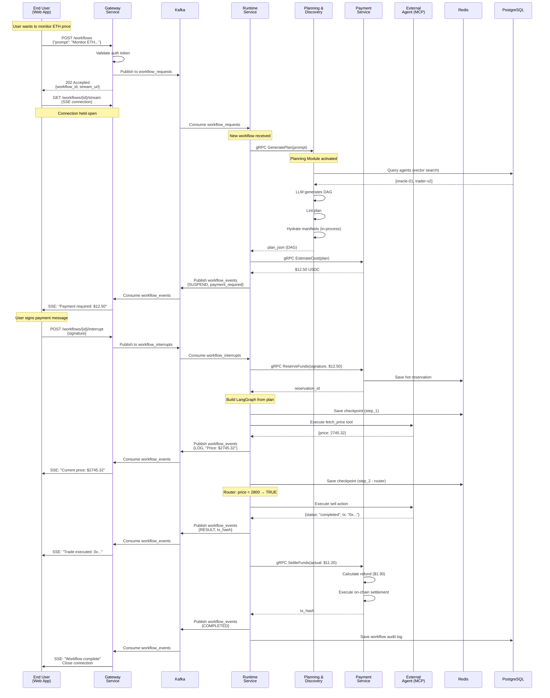
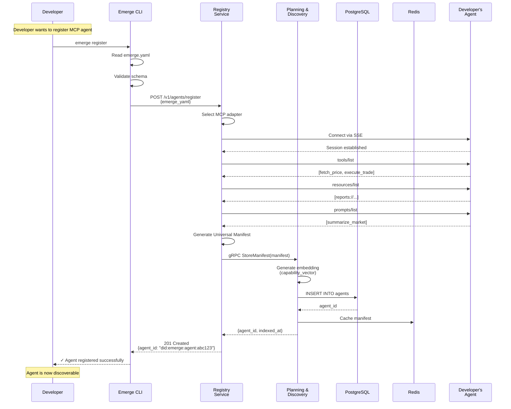
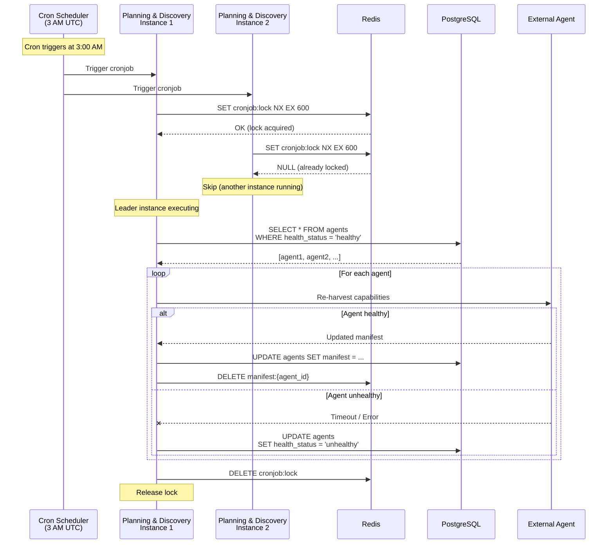

# MetaOrcha System Architecture Specification
**Version**: 2.0  
**Date**: January 2026  
**Status**: Final Design

---

## Table of Contents
1. [Executive Summary](#1-executive-summary)
2. [System Overview](#2-system-overview)
3. [Core Architecture Principles](#3-core-architecture-principles)
4. [Microservice Architecture](#4-microservice-architecture)
5. [Service Specifications](#5-service-specifications)
6. [Communication Patterns](#6-communication-patterns)
7. [Data Architecture](#7-data-architecture)
8. [End-to-End Flows](#8-end-to-end-flows)
9. [Scaling Strategy](#9-scaling-strategy)
10. [Failure Modes & Recovery](#10-failure-modes--recovery)
11. [Technology Stack](#11-technology-stack)
12. [Deployment Architecture](#12-deployment-architecture)

---

## 1. Executive Summary

MetaOrcha is a **dynamic multi-agent workflow orchestration platform** that enables users to execute complex AI workflows by automatically discovering, composing, and orchestrating heterogeneous AI agents (MCP, A2A, ACP protocols) with built-in payment infrastructure (x402).

### Key Capabilities
- **Dynamic Agent Discovery**: Vector search + semantic ranking across 1000s of registered agents
- **Intelligent Planning**: LLM-powered DAG generation with dependency resolution
- **Multi-Protocol Support**: MCP (Model Context Protocol), A2A (Agent-to-Agent), ACP (Agent Communication Protocol)
- **Economic Infrastructure**: x402 payment protocol with on-chain escrow settlement
- **Human-in-the-Loop**: Seamless interrupt handling for auth, approvals, and payments
- **Horizontal Scalability**: Kafka-based event-driven architecture supporting 10,000+ concurrent workflows

### Design Goals
- **Latency**: Agent discovery <300ms, Streaming <1s, Interrupts <5s
- **Scale**: 10-20 agents at launch → 1000s of agents within 12 months
- **Throughput**: 30-50 concurrent workflows initially → 10,000s at peak
- **Durability**: Critical state persistence (workflows survive system crashes)
- **Developer Experience**: Single SDK, minimal configuration, automatic harvesting

---

## 2. System Overview

### 2.1 High-Level Architecture

```
┌─────────────────────────────────────────────────────────────────┐
│                      EXTERNAL SYSTEMS                           │
│  • AI Agents (MCP/A2A/ACP)  • Blockchain (Base)  • OAuth        │
└──────────────────────┬──────────────────────────────────────────┘
                       │
┌──────────────────────┴──────────────────────────────────────────┐
│                      CLIENT LAYER                               │
│  Web App / Mobile / CLI  ←─ WebSocket/SSE ─→  API Gateway       │
└──────────────────────┬──────────────────────────────────────────┘
                       │
                       ▼
┌─────────────────────────────────────────────────────────────────┐
│                   METAORCHA PLATFORM                            │
│                                                                 │
│  ┌──────────────┐    ┌──────────────────────────────────┐     │
│  │   Gateway    │    │   Orchestration Runtime          │     │
│  │   Service    │◄──►│   Service                        │     │
│  └──────────────┘    └──────────────────────────────────┘     │
│         │                        │                             │
│         │                        ▼                             │
│         │            ┌────────────────────────┐                │
│         │            │  Planning & Discovery  │                │
│         │            │  Service (MERGED)      │                │
│         │            │  • LLM DAG Generation  │                │
│         │            │  • Vector Search       │                │
│         └───────────►│  • Agent Ranking       │                │
│                      │  • Manifest Caching    │                │
│                      │  • Nightly Refresh     │                │
│                      └────────────────────────┘                │
│                                 │                               │
│         ┌───────────────────────┼───────────────────┐          │
│         ▼                       ▼                   ▼          │
│  ┌──────────┐          ┌──────────┐        ┌──────────┐       │
│  │   Auth   │          │ Registry │        │ Payment  │       │
│  │ Service  │          │ Service  │        │ Service  │       │
│  └──────────┘          └──────────┘        └──────────┘       │
│                                                                 │
└─────────────────────────────────────────────────────────────────┘
                       │
                       ▼
┌─────────────────────────────────────────────────────────────────┐
│                   DATA & MESSAGE LAYER                          │
│  PostgreSQL (Supabase)  |  Redis Cluster  |  Kafka Cluster     │
└─────────────────────────────────────────────────────────────────┘
```

### 2.2 Service Inventory

| Service | Responsibility | Protocol | Scaling |
|---------|---------------|----------|---------|
| **Gateway** | Client connections, HTTP/WebSocket server | HTTP, SSE, WebSocket | Stateless, horizontal |
| **Runtime** | LangGraph execution, workflow orchestration | Kafka consumer, gRPC client | Stateless, horizontal |
| **Planning & Discovery** | Agent search, DAG generation, manifest management | gRPC server | Stateless, horizontal |
| **Registry** | Agent registration, harvesting | REST API, gRPC client | Low traffic, 1-2 instances |
| **Payment** | x402 escrow, on-chain settlement | gRPC server, Web3 | Stateless, horizontal |
| **Auth** | OAuth flows, secret management | REST API, gRPC server | Stateless, horizontal |

---

## 3. Core Architecture Principles

### 3.1 Design Decisions

#### **Gateway + Runtime Separation**
- **Rationale**: Gateway handles stateful connections (WebSocket/SSE), Runtime handles CPU-intensive execution
- **Benefit**: Independent scaling (Gateway scales on connection count, Runtime scales on workflow throughput)
- **Communication**: Kafka topics decouple services, enable backpressure handling

#### **Planning + Manifest Merger**
- **Rationale**: Planning requires frequent manifest lookups (3+ per request), gRPC overhead adds 15-30ms
- **Benefit**: Direct database access reduces latency by ~20ms, shared cache improves hit rate
- **Trade-off**: Cronjob interference mitigated via leader election (Redis lock)

#### **Kafka for Async Communication**
- **Rationale**: Workflows are long-running (up to 1 hour), need reliable delivery across crashes
- **Benefit**: At-least-once delivery, horizontal scaling via partitions, event replay
- **Topics**: `workflow_requests`, `workflow_events`, `workflow_interrupts`

#### **Redis for State Persistence**
- **Rationale**: LangGraph checkpoints must survive crashes, sub-second read/write required
- **Benefit**: AOF/RDB persistence, cluster mode for high availability
- **Usage**: Checkpoints, token cache, payment reservations, distributed locks

#### **Shared PostgreSQL**
- **Rationale**: At 10-20 agents, separate databases add complexity without benefit
- **Benefit**: ACID transactions, pgvector for semantic search, managed backups (Supabase)
- **Future**: Read replicas when agent count exceeds 1000

### 3.2 Non-Functional Requirements

| Requirement | Target | Measurement |
|-------------|--------|-------------|
| **Availability** | 99.9% | 43 minutes downtime/month |
| **Agent Discovery Latency** | <300ms (p95) | Planning Service response time |
| **Streaming Latency** | <1s (p95) | Gateway → Client event delivery |
| **Interrupt Response** | <5s (p95) | User input → workflow resumption |
| **Checkpoint Persistence** | 100% durability | Redis AOF + RDB snapshots |
| **Horizontal Scalability** | 10,000+ concurrent workflows | Kafka partitions + Runtime instances |

---

## 4. Microservice Architecture

### 4.1 Updated Architecture Diagram

```
┌─────────────────────────────────────────────────────────────────┐
│                         CLIENT LAYER                            │
│  (Web App / Mobile / CLI) ←─ WebSocket/SSE ─→ API Gateway       │
└──────────────────────┬──────────────────────────────────────────┘
                       │
                       ▼
┌─────────────────────────────────────────────────────────────────┐
│                    API GATEWAY SERVICE                          │
│  • FastAPI (async Python)                                       │
│  • WebSocket + SSE stream management                            │
│  • Auth token validation (via Auth Service)                     │
│  • Request routing to Kafka                                     │
│  • Event streaming to clients                                   │
└───────┬─────────────────────────────────┬───────────────────────┘
        │                                 │
        │ gRPC                           │ Kafka
        │ (token validation)              │ (async events)
        ▼                                 ▼
┌──────────────────┐           ┌──────────────────────────────────┐
│  AUTH SERVICE    │           │   ORCHESTRATION RUNTIME SERVICE  │
│                  │           │                                  │
│  • User mgmt     │           │  • LangGraph execution engine    │
│  • OAuth flows   │           │  • Kafka consumer (requests)     │
│  • Token cache   │           │  • Protocol adapters (MCP/A2A)   │
│  • Vault proxy   │           │  • Pre-flight checks             │
│  • gRPC server   │           │  • Interrupt handling            │
│                  │           │  • Redis checkpointing           │
└──────────────────┘           │  • Kafka producer (events)       │
                               └────┬─────────────────────────────┘
                                    │
                     ┌──────────────┼──────────────┐
                     │              │              │
                     ▼              ▼              ▼
              ┌────────────────────────┐    ┌────────────┐
              │ PLANNING & DISCOVERY   │    │  PAYMENT   │
              │ SERVICE (MERGED)       │    │  SERVICE   │
              │                        │    │            │
              │ ┌──────────────────┐  │    │ • x402     │
              │ │ Planning Module  │  │    │   escrow   │
              │ │ • LLM DAG gen    │  │    │ • Web3.py  │
              │ │ • Linter         │  │    │ • On-chain │
              │ │ • Hydrator       │  │    │   calls    │
              │ └────────┬─────────┘  │    │ • gRPC     │
              │          │            │    │   server   │
              │ ┌────────▼─────────┐  │    └────────────┘
              │ │ Discovery Module │  │
              │ │ • Vector search  │  │
              │ │ • Agent ranking  │  │
              │ │ • Caching layer  │  │
              │ └──────────────────┘  │
              │                        │
              │ ┌──────────────────┐  │
              │ │ Background Jobs  │  │
              │ │ • Manifest refresh│ │
              │ │ • Health checks   │ │
              │ │ • Leader election │ │
              │ └──────────────────┘  │
              │                        │
              │ • gRPC server          │
              │ • Shared Redis/DB      │
              └────────────────────────┘
                          │
                          ▼
              ┌───────────────────────┐
              │   REGISTRY SERVICE    │
              │                       │
              │ • Agent registration  │
              │ • MCP/A2A harvesting  │
              │ • REST API            │
              │ • gRPC client         │
              └───────────────────────┘
                          │
          ┌───────────────┴───────────────┐
          ▼                               ▼
  ┌──────────────┐              ┌──────────────┐
  │  PostgreSQL  │              │ Redis Cluster│
  │  (Supabase)  │              │              │
  │              │              │ • Checkpoints│
  │ • Manifests  │              │ • Tokens     │
  │ • Users      │              │ • Locks      │
  │ • Workflows  │              │ • Cache      │
  │ • Payments   │              │ • Reserv.    │
  │ • pgvector   │              │              │
  └──────────────┘              └──────────────┘
          │
          └──────────────┐
                         ▼
                ┌──────────────┐
                │    Kafka     │
                │   Cluster    │
                │              │
                │ • workflow_  │
                │   requests   │
                │ • workflow_  │
                │   events     │
                │ • workflow_  │
                │   interrupts │
                └──────────────┘
```

---

## 5. Service Specifications

### 5.1 API Gateway Service

#### **Responsibility**
User-facing HTTP/WebSocket server. Routes requests to backend, streams workflow events to clients.

#### **Technology Stack**
- **Framework**: FastAPI (Python, async)
- **Protocols**: HTTP/2, WebSocket, Server-Sent Events (SSE)
- **Load Balancer**: Nginx (TLS termination, sticky sessions for WebSocket)

#### **Key Endpoints**

```python
# 1. Workflow Submission
POST /v1/workflows
Headers: Authorization: Bearer <token>
Body: {
  "prompt": "Monitor ETH price, sell if drops below $2800",
  "user_id": "user_123"
}
Response: 202 Accepted
{
  "workflow_id": "wf_abc123",
  "stream_url": "/v1/workflows/wf_abc123/stream",
  "estimated_cost": 12.50  # USDC
}

# 2. Event Streaming (SSE)
GET /v1/workflows/{workflow_id}/stream
Headers: Authorization: Bearer <token>
Response: text/event-stream
data: {"event": "LOG", "message": "Fetching ETH price..."}
data: {"event": "SUSPEND", "type": "payment_required", "amount": 12.50}
data: {"event": "RESULT", "data": {...}}
data: {"event": "COMPLETED"}

# 3. Interrupt Handling
POST /v1/workflows/{workflow_id}/interrupt
Body: {
  "type": "payment_signature",
  "data": {"signature": "0x...", "reservation_id": "res_xyz"}
}
Response: 200 OK
```

#### **Internal Flow**

```python
from fastapi import FastAPI, WebSocket
from kafka import KafkaProducer, KafkaConsumer
import asyncio

app = FastAPI()
kafka_producer = KafkaProducer(bootstrap_servers='kafka:9092')

@app.post("/v1/workflows")
async def create_workflow(request: WorkflowRequest):
    # 1. Validate auth token (gRPC call to Auth Service)
    user = await auth_client.validate_token(request.token)
    
    # 2. Generate workflow ID
    workflow_id = generate_id()
    
    # 3. Publish to Kafka (non-blocking)
    kafka_producer.send('workflow_requests', {
        "workflow_id": workflow_id,
        "user_id": user.id,
        "prompt": request.prompt,
        "timestamp": utcnow()
    })
    
    # 4. Return immediately (don't wait for execution)
    return {
        "workflow_id": workflow_id,
        "stream_url": f"/v1/workflows/{workflow_id}/stream"
    }

@app.get("/v1/workflows/{workflow_id}/stream")
async def stream_workflow(workflow_id: str):
    # Server-Sent Events generator
    async def event_generator():
        # Subscribe to Kafka (filter by workflow_id)
        consumer = KafkaConsumer('workflow_events', group_id='gateway')
        
        for message in consumer:
            event = message.value
            if event["workflow_id"] == workflow_id:
                yield f"data: {json.dumps(event)}\n\n"
                
                if event["event_type"] == "COMPLETED":
                    break
    
    return StreamingResponse(event_generator(), media_type="text/event-stream")
```

#### **Scaling Strategy**
- **Horizontal**: 2-20+ instances behind load balancer
- **Stateless**: No workflow state stored (Kafka handles message delivery)
- **Sticky Sessions**: Load balancer routes same `workflow_id` to same instance (optional optimization)
- **Redis Pub/Sub**: For cross-instance SSE broadcasting (if needed)

---

### 5.2 Orchestration Runtime Service

#### **Responsibility**
Execute LangGraph workflows. Consume requests from Kafka, call Planning & Discovery for DAG, execute agents, publish events.

#### **Technology Stack**
- **Framework**: Python (asyncio)
- **Orchestration**: LangGraph
- **State**: Redis (checkpointing)
- **Messaging**: Kafka (consumer + producer)
- **Communication**: gRPC clients (Planning & Discovery, Payment, Auth)

#### **Key Flow**

```python
from kafka import KafkaConsumer, KafkaProducer
from langgraph.graph import StateGraph
import asyncio

kafka_consumer = KafkaConsumer('workflow_requests', group_id='runtime-workers')
kafka_producer = KafkaProducer()

async def consume_workflow_requests():
    """Main consumer loop"""
    async for message in kafka_consumer:
        workflow_id = message.value["workflow_id"]
        user_prompt = message.value["prompt"]
        user_id = message.value["user_id"]
        
        try:
            # 1. Call Planning & Discovery Service (gRPC)
            plan = await planning_client.GeneratePlan(
                user_prompt=user_prompt,
                user_id=user_id
            )
            
            # 2. Estimate cost (gRPC to Payment Service)
            cost = await payment_client.EstimateCost(plan=plan.plan_json)
            
            # 3. Request payment authorization
            await kafka_producer.send('workflow_events', {
                "workflow_id": workflow_id,
                "event_type": "SUSPEND",
                "data": {"type": "payment_required", "amount": cost}
            })
            
            # 4. Wait for interrupt (Kafka consumer on workflow_interrupts)
            interrupt = await wait_for_interrupt(workflow_id, timeout=300)
            
            # 5. Reserve funds
            reservation = await payment_client.ReserveFunds(
                signature=interrupt["data"]["signature"],
                amount=cost
            )
            
            # 6. Build LangGraph from plan JSON
            graph = WorkflowInterpreter(plan.plan_json).build()
            
            # 7. Execute workflow (async generator)
            async for event in execute_workflow(graph, workflow_id):
                # 8. Publish events to Kafka
                await kafka_producer.send('workflow_events', {
                    "workflow_id": workflow_id,
                    "event_type": event.type,  # LOG, RESULT, SUSPEND, etc.
                    "data": event.data,
                    "timestamp": utcnow()
                })
            
            # 9. Settle payment
            await payment_client.SettleFunds(
                reservation_id=reservation.id,
                actual_cost=calculate_actual_cost(graph.state)
            )
            
            # 10. Publish completion
            await kafka_producer.send('workflow_events', {
                "workflow_id": workflow_id,
                "event_type": "COMPLETED",
                "timestamp": utcnow()
            })
            
        except Exception as e:
            # Publish error event
            await kafka_producer.send('workflow_events', {
                "workflow_id": workflow_id,
                "event_type": "ERROR",
                "data": {"error": str(e)},
                "timestamp": utcnow()
            })
```

#### **Checkpointing**

```python
# LangGraph config points to Redis
from langgraph.checkpoint.redis import RedisSaver

redis_checkpointer = RedisSaver(
    redis_client=redis.Redis(host='redis-cluster', port=6379),
    key_prefix="checkpoint:"
)

graph = StateGraph(AgentState, checkpointer=redis_checkpointer)

# Checkpoint is saved after each node execution
config = {"configurable": {"thread_id": workflow_id}}
result = graph.invoke(initial_state, config=config)
```

#### **Scaling Strategy**
- **Horizontal**: 3-50+ instances (Kafka consumer group)
- **Partitioning**: Kafka partitions = max parallelism (start with 10)
- **Stateless**: Checkpoints in Redis enable any instance to resume any workflow
- **Circuit Breakers**: Per-agent circuit breakers prevent cascading failures

---

### 5.3 Planning & Discovery Service (MERGED)

#### **Responsibility**
1. **Planning Module**: Generate LangGraph DAG from user prompt
2. **Discovery Module**: Search/rank agents, cache manifests, hydrate plans
3. **Background Jobs**: Nightly manifest refresh, health monitoring

#### **Technology Stack**
- **Framework**: Python
- **Server**: gRPC (sync requests)
- **Database**: Supabase (PostgreSQL + pgvector)
- **Cache**: Redis
- **LLM**: OpenAI GPT-4 / Anthropic Claude (configurable)
- **Scheduler**: APScheduler (cronjobs)

#### **Module Structure**

```
planning-discovery-service/
├── api/
│   ├── grpc_server.py          # gRPC service definition
│   └── health.py
├── planning/
│   ├── dag_generator.py        # LLM-based DAG generation
│   ├── linter.py               # Manifest validation
│   └── hydrator.py             # Inject full agent configs
├── discovery/
│   ├── vector_search.py        # pgvector queries
│   ├── ranking.py              # BM25 + RRF fusion
│   ├── cache.py                # Redis caching layer
│   └── query_resolver.py       # LLM extracts semantic + filters
├── background/
│   ├── cronjobs.py             # Manifest refresh, health checks
│   └── leader_election.py      # Redis distributed lock
├── shared/
│   ├── db.py                   # Supabase client
│   ├── redis.py                # Redis client
│   └── embeddings.py           # Embedding model (sentence-transformers)
└── main.py
```

#### **gRPC Service Definition**

```protobuf
// planning_discovery.proto

service PlanningDiscoveryService {
  // Planning RPCs
  rpc GeneratePlan(PlanRequest) returns (PlanResponse);
  rpc ValidatePlan(ValidateRequest) returns (ValidateResponse);
  
  // Discovery RPCs
  rpc SearchAgents(SearchRequest) returns (SearchResponse);
  rpc GetManifest(GetRequest) returns (Manifest);
  rpc HydrateManifests(HydrateRequest) returns (HydrateResponse);
}

message PlanRequest {
  string user_prompt = 1;
  string user_id = 2;
  repeated string preferred_agents = 3;
}

message PlanResponse {
  string plan_json = 1;           // LangGraph DAG
  repeated string agent_ids = 2;   // Agents used
  float estimated_cost = 3;        // USD
}

message SearchRequest {
  string query = 1;
  int32 max_results = 2;
  map<string, string> filters = 3;  // chain_id, protocol, etc.
}

message SearchResponse {
  repeated AgentSummary agents = 1;
}
```

#### **Implementation**

```python
# api/grpc_server.py

from grpc import aio
from planning import DAGGenerator
from discovery import VectorSearch

class PlanningDiscoveryService(planning_pb2_grpc.PlanningDiscoveryServiceServicer):
    def __init__(self):
        # Shared dependencies (singleton pattern)
        self.db = get_db_client()
        self.redis = get_redis_client()
        self.embeddings = get_embedding_model()
        
        # Planning module
        self.dag_generator = DAGGenerator(self.redis, self.db)
        
        # Discovery module
        self.vector_search = VectorSearch(self.db, self.redis, self.embeddings)
    
    async def GeneratePlan(self, request, context):
        """
        Unified planning flow:
        1. Search agents (in-process, no gRPC!)
        2. Generate DAG
        3. Hydrate manifests (in-process, no gRPC!)
        """
        # Step 1: Agent discovery (direct DB access)
        agents = await self.vector_search.search(
            query=request.user_prompt,
            max_results=50
        )
        
        # Step 2: DAG generation (LLM call)
        plan_json = await self.dag_generator.generate(
            prompt=request.user_prompt,
            available_agents=agents  # Already in memory!
        )
        
        # Step 3: Lint plan
        linter = ManifestLinter(plan_json)
        if not linter.validate():
            # Self-healing: retry with errors
            plan_json = await self.dag_generator.regenerate(
                errors=linter.errors
            )
        
        # Step 4: Hydration (direct DB access)
        hydrated_plan = await self.vector_search.hydrate(plan_json)
        
        return PlanResponse(
            plan_json=hydrated_plan,
            agent_ids=[a.id for a in agents],
            estimated_cost=calculate_cost(hydrated_plan)
        )
    
    async def SearchAgents(self, request, context):
        """
        Exposed for Registry Service + external clients
        """
        return await self.vector_search.search(request.query)
```

#### **Vector Search Implementation**

```python
# discovery/vector_search.py

class VectorSearch:
    def __init__(self, db, redis, embedding_model):
        self.db = db
        self.redis = redis
        self.embeddings = embedding_model
    
    async def search(self, query: str, max_results: int = 50):
        # 1. Check Redis cache
        cache_key = f"search:{hash(query)}"
        if cached := await self.redis.get(cache_key):
            return json.loads(cached)
        
        # 2. Query Resolver (LLM extracts semantic + filters)
        semantic_query, filters = await self._resolve_query(query)
        
        # 3. Generate embedding
        embedding = self.embeddings.encode(semantic_query)
        
        # 4. Hybrid search (pgvector + SQL filters)
        results = await self.db.rpc("hybrid_agent_search", {
            "query_embedding": embedding.tolist(),
            "chain_id": filters.get("chain_id"),
            "protocol": filters.get("protocol"),
            "health_status": "healthy",
            "limit": max_results
        })
        
        # 5. Cache results (1 day TTL)
        await self.redis.setex(cache_key, 86400, json.dumps(results))
        
        return results
    
    async def _resolve_query(self, query: str):
        """
        Use fast LLM (GPT-4o-mini) to extract:
        - Semantic intent: "crypto trading bot"
        - Filters: {"chain_id": "eip155:8453", "protocol": "mcp"}
        """
        prompt = f"""
        Extract semantic intent and filters from this query:
        "{query}"
        
        Respond ONLY with JSON:
        {{
          "semantic": "short semantic description",
          "filters": {{"chain_id": "...", "protocol": "..."}}
        }}
        """
        response = await llm_client.generate(prompt, max_tokens=100)
        return json.loads(response)
```

#### **Background Jobs with Leader Election**

```python
# background/cronjobs.py

from apscheduler.schedulers.asyncio import AsyncIOScheduler
import redis

redis_client = redis.Redis()
scheduler = AsyncIOScheduler()

@scheduler.scheduled_job('cron', hour=3, minute=0)  # 3 AM daily
async def refresh_agent_manifests():
    """
    Re-scan all agents for manifest changes.
    Only ONE instance runs this (Redis lock).
    """
    # Try to acquire distributed lock (10 min expiry)
    lock_acquired = redis_client.set(
        "cronjob:manifest_refresh",
        "running",
        nx=True,   # Only set if doesn't exist
        ex=600     # Expires in 10 minutes
    )
    
    if not lock_acquired:
        print("[Cronjob] Another instance is running manifest refresh, skipping")
        return
    
    try:
        print("[Cronjob] Starting manifest refresh...")
        
        # Fetch all healthy agents
        agents = await db.query(
            "SELECT * FROM agents WHERE health_status = 'healthy'"
        )
        
        for agent in agents:
            try:
                # Re-harvest capabilities
                updated_manifest = await harvest_agent(
                    endpoint=agent.endpoint,
                    protocol=agent.protocol
                )
                
                # Update database
                await db.execute(
                    """
                    UPDATE agents 
                    SET manifest = $1, updated_at = NOW() 
                    WHERE id = $2
                    """,
                    updated_manifest,
                    agent.id
                )
                
                # Invalidate cache
                await redis_client.delete(f"manifest:{agent.id}")
                
                print(f"[Cronjob] Refreshed agent {agent.id}")
                
            except Exception as e:
                print(f"[Cronjob] Failed to refresh {agent.id}: {e}")
                # Mark as unhealthy
                await db.execute(
                    "UPDATE agents SET health_status = 'unhealthy' WHERE id = $1",
                    agent.id
                )
        
        print(f"[Cronjob] Manifest refresh completed: {len(agents)} agents")
        
    finally:
        # Always release lock
        redis_client.delete("cronjob:manifest_refresh")

# Start scheduler on service boot
scheduler.start()
```

#### **Performance Benefits of Merger**

| Operation | Before (Separated) | After (Merged) | Savings |
|-----------|-------------------|----------------|---------|
| **Planning request** | 3 gRPC calls (Planning → Manifest) | 0 gRPC calls (in-process) | ~20ms |
| **Cache locality** | Separate Redis clients | Shared Redis client | +5% hit rate |
| **Code complexity** | 2 repos, 2 deployments | 1 repo, 1 deployment | -50% ops overhead |
| **Database connections** | 2 connection pools | 1 connection pool | -50% DB connections |

#### **Scaling Strategy**
- **Horizontal**: 1-10+ instances (gRPC load balancing)
- **Stateless**: All instances can handle any request
- **Cronjob**: Only leader runs (Redis lock), no interference with request traffic
- **CPU**: Planning (LLM) is CPU-bound, Discovery (vector search) is I/O-bound → balanced resource usage

---

### 5.4 Registry Service

#### **Responsibility**
Accept agent registrations from developers, harvest capabilities, generate Universal Manifest, store in Planning & Discovery Service.

#### **Technology Stack**
- **Framework**: FastAPI (REST API)
- **Adapters**: MCP Client, A2A Client
- **Communication**: gRPC client (to Planning & Discovery)

#### **API**

```python
POST /v1/agents/register
Headers: X-API-Key: <developer_key>
Body: {
  "emerge_yaml": {
    "identity": {...},
    "protocol": {"type": "mcp", "transport": {...}},
    "security": {...},
    "payment": {...}
  }
}

Response: 201 Created
{
  "agent_id": "did:emerge:agent:abc123",
  "status": "registered",
  "indexed_at": "2026-01-20T10:00:00Z"
}
```

#### **Implementation**

```python
from fastapi import FastAPI, HTTPException
from adapters import MCPAdapter, A2AAdapter

app = FastAPI()

@app.post("/v1/agents/register")
async def register_agent(request: RegistrationRequest):
    # 1. Validate emerge.yaml schema
    if not validate_schema(request.emerge_yaml):
        raise HTTPException(400, "Invalid schema")
    
    # 2. Select adapter based on protocol
    if request.emerge_yaml["protocol"]["type"] == "mcp":
        adapter = MCPAdapter()
    elif request.emerge_yaml["protocol"]["type"] == "a2a":
        adapter = A2AAdapter()
    else:
        raise HTTPException(400, "Unsupported protocol")
    
    # 3. Harvest capabilities (connect to live agent)
    try:
        capabilities = await adapter.harvest(
            endpoint=request.emerge_yaml["protocol"]["transport"]["endpoint"]
        )
    except Exception as e:
        raise HTTPException(500, f"Harvesting failed: {e}")
    
    # 4. Generate Universal Manifest
    manifest = generate_universal_manifest(
        emerge_yaml=request.emerge_yaml,
        capabilities=capabilities
    )
    
    # 5. Store in Planning & Discovery Service (gRPC)
    response = await planning_discovery_client.StoreManifest(manifest)
    
    # 6. Return agent ID
    return {
        "agent_id": response.agent_id,
        "status": "registered",
        "indexed_at": response.indexed_at
    }
```

---

### 5.5 Payment Service

#### **Responsibility**
x402 payment protocol, escrow management, on-chain settlement.

#### **Technology Stack**
- **Framework**: Python
- **Blockchain**: Web3.py (Base L2)
- **Server**: gRPC
- **Cache**: Redis (hot reservations)

#### **gRPC Service**

```protobuf
service PaymentService {
  rpc EstimateCost(CostRequest) returns (CostEstimate);
  rpc ReserveFunds(ReserveRequest) returns (ReservationId);
  rpc SettleFunds(SettleRequest) returns (TxHash);
  rpc RefundFunds(RefundRequest) returns (TxHash);
}
```

#### **Implementation**

```python
async def reserve_funds(request):
    # 1. Calculate estimated cost from plan
    estimated_cost = sum(
        agent["payment"]["price"] 
        for agent in request.plan["agents"]
    )
    
    # 2. Verify user signature (EIP-712)
    message = {
        "workflow_id": request.workflow_id,
        "amount": estimated_cost,
        "timestamp": utcnow()
    }
    if not verify_eip712_signature(request.signature, message, request.user_wallet):
        raise ValueError("Invalid signature")
    
    # 3. Create hot reservation in Redis
    reservation_id = generate_id()
    await redis.setex(
        f"reservation:{reservation_id}",
        3600,  # 1 hour TTL
        json.dumps({
            "user_id": request.user_id,
            "workflow_id": request.workflow_id,
            "amount": estimated_cost,
            "timestamp": utcnow()
        })
    )
    
    return ReservationId(id=reservation_id, amount=estimated_cost)
```

---

### 5.6 Auth Service

#### **Responsibility**
User authentication, OAuth flows, secret management (API keys, tokens).

#### **Technology Stack**
- **Framework**: FastAPI (REST + gRPC)
- **OAuth**: Authlib
- **Secrets**: AWS Secrets Manager / HashiCorp Vault
- **Cache**: Redis (token cache)

#### **Key Flows**

```python
# OAuth2 Authorization Code Flow
@app.get("/auth/oauth/{provider}/authorize")
async def oauth_authorize(provider: str):
    # Build authorization URL
    auth_url = build_oauth_url(
        provider=provider,
        redirect_uri=f"{BASE_URL}/auth/oauth/{provider}/callback",
        scopes=PROVIDER_SCOPES[provider]
    )
    return RedirectResponse(auth_url)

@app.get("/auth/oauth/{provider}/callback")
async def oauth_callback(provider: str, code: str, state: str):
    # 1. Exchange code for tokens
    tokens = await oauth_client.exchange_code(
        provider=provider,
        code=code
    )
    
    # 2. Cache access token
    await redis.setex(
        f"auth:{state['user_id']}:{provider}:access",
        tokens["expires_in"],
        tokens["access_token"]
    )
    
    # 3. Store refresh token in Vault
    await vault.save_secret(
        f"{provider}_refresh_token",
        tokens["refresh_token"]
    )
    
    return RedirectResponse("/dashboard")
```

---

## 6. Communication Patterns

### 6.1 Kafka Topics

#### **Topic 1: `workflow_requests`**
```json
{
  "workflow_id": "wf_abc123",
  "user_id": "user_xyz",
  "prompt": "Monitor ETH price, sell if drops below $2800",
  "timestamp": "2026-01-20T10:00:00Z"
}
```
- **Producers**: Gateway
- **Consumers**: Runtime (consumer group: `runtime-workers`)
- **Partitions**: 10 (scales to 50)
- **Retention**: 7 days

---

#### **Topic 2: `workflow_events`**
```json
{
  "workflow_id": "wf_abc123",
  "event_type": "LOG" | "RESULT" | "SUSPEND" | "COMPLETED" | "ERROR",
  "data": {...},
  "timestamp": "2026-01-20T10:00:01Z"
}
```
- **Producers**: Runtime
- **Consumers**: Gateway (consumer group: `gateway-streamers`)
- **Partitions**: 10
- **Retention**: 7 days

---

#### **Topic 3: `workflow_interrupts`**
```json
{
  "workflow_id": "wf_abc123",
  "interrupt_type": "auth_input" | "payment_signature" | "hitl_approval",
  "data": {...},
  "timestamp": "2026-01-20T10:00:05Z"
}
```
- **Producers**: Gateway
- **Consumers**: Runtime (consumer group: `runtime-workers`)
- **Partitions**: 10
- **Retention**: 7 days

---

### 6.2 gRPC Service Mesh

```
Runtime Service:
  → Planning & Discovery (GeneratePlan, SearchAgents)
  → Payment (EstimateCost, ReserveFunds, SettleFunds)
  → Auth (ValidateToken, GetUserSecret)

Gateway Service:
  → Auth (ValidateToken)

Registry Service:
  → Planning & Discovery (StoreManifest)

Planning & Discovery Service:
  → (no outbound gRPC calls - leaf service)
```

---

## 7. Data Architecture

### 7.1 PostgreSQL Schema (Supabase)

```sql
-- Agents table
CREATE TABLE agents (
  id UUID PRIMARY KEY DEFAULT gen_random_uuid(),
  did TEXT UNIQUE NOT NULL,  -- did:emerge:agent:abc123
  name TEXT NOT NULL,
  version TEXT NOT NULL,
  provider TEXT,
  description TEXT,
  tags TEXT[],
  protocol_type TEXT NOT NULL,  -- 'mcp' | 'a2a'
  transport JSONB NOT NULL,
  security JSONB NOT NULL,
  payment JSONB NOT NULL,
  capabilities JSONB NOT NULL,
  health_status TEXT DEFAULT 'healthy',
  health_endpoint TEXT,
  created_at TIMESTAMPTZ DEFAULT NOW(),
  updated_at TIMESTAMPTZ DEFAULT NOW(),
  
  -- Vector embedding for semantic search
  capability_vector vector(1536)
);

-- Indices
CREATE INDEX idx_agents_health ON agents(health_status);
CREATE INDEX idx_agents_protocol ON agents(protocol_type);
CREATE INDEX idx_agents_tags ON agents USING GIN(tags);

-- pgvector HNSW index for fast similarity search
CREATE INDEX idx_agents_vector ON agents 
USING hnsw (capability_vector vector_cosine_ops);

-- Hybrid search function
CREATE OR REPLACE FUNCTION hybrid_agent_search(
  query_embedding vector(1536),
  chain_id TEXT DEFAULT NULL,
  protocol TEXT DEFAULT NULL,
  health_status TEXT DEFAULT 'healthy',
  limit_count INT DEFAULT 50
)
RETURNS TABLE (
  id UUID,
  name TEXT,
  similarity_score FLOAT
)
LANGUAGE plpgsql
AS $$
BEGIN
  RETURN QUERY
  SELECT 
    a.id,
    a.name,
    (1 - (a.capability_vector <=> query_embedding)) AS similarity_score
  FROM agents a
  WHERE 
    a.health_status = hybrid_agent_search.health_status
    AND (protocol IS NULL OR a.protocol_type = protocol)
    AND (chain_id IS NULL OR a.payment->>'chain_id' = chain_id)
  ORDER BY similarity_score DESC
  LIMIT limit_count;
END;
$$;

-- Users table
CREATE TABLE users (
  id UUID PRIMARY KEY DEFAULT gen_random_uuid(),
  email TEXT UNIQUE NOT NULL,
  wallet_address TEXT,
  created_at TIMESTAMPTZ DEFAULT NOW()
);

-- Workflows table (audit log)
CREATE TABLE workflows (
  id UUID PRIMARY KEY,
  user_id UUID REFERENCES users(id),
  prompt TEXT NOT NULL,
  plan_json JSONB NOT NULL,
  status TEXT NOT NULL,  -- 'running' | 'completed' | 'failed'
  estimated_cost DECIMAL(10,2),
  actual_cost DECIMAL(10,2),
  started_at TIMESTAMPTZ DEFAULT NOW(),
  completed_at TIMESTAMPTZ
);

-- User secrets (encrypted)
CREATE TABLE user_secrets (
  user_id UUID REFERENCES users(id),
  key TEXT NOT NULL,
  encrypted_value BYTEA NOT NULL,  -- AES-256 encrypted
  created_at TIMESTAMPTZ DEFAULT NOW(),
  PRIMARY KEY (user_id, key)
);
```

---

### 7.2 Redis Schema

```
# LangGraph Checkpoints
checkpoint:{workflow_id}:{step_id}
  Value: {
    "state": {...},      # AgentState
    "timestamp": "...",
    "node_id": "step_3"
  }
  TTL: 7 days

# Auth Token Cache
auth:{user_id}:{provider}:access
  Value: "eyJhbGc..."   # JWT access token
  TTL: 3600 (1 hour)

# Payment Reservations
reservation:{reservation_id}
  Value: {
    "user_id": "...",
    "workflow_id": "...",
    "amount": 12.50,
    "timestamp": "..."
  }
  TTL: 3600 (1 hour)

# Manifest Cache
manifest:{agent_id}
  Value: {...}          # Full Universal Manifest
  TTL: 86400 (1 day)

# Vector Search Cache
search:{hash(query)}
  Value: [{agent_id, score}, ...]
  TTL: 86400 (1 day)

# Distributed Locks (Leader Election)
cronjob:manifest_refresh:lock
  Value: "instance_id"
  TTL: 600 (10 minutes)
```

---

## 8. End-to-End Flows

### 8.1 End User Flow: Workflow Execution



---

### 8.2 Developer Flow: Agent Registration



---

### 8.3 Background Job: Nightly Manifest Refresh



---

## 9. Scaling Strategy

### 9.1 Initial Deployment (Launch)

```
Service                 Instances    Resources (per instance)
─────────────────────────────────────────────────────────────
Gateway                 2            2 CPU, 4GB RAM
Runtime                 3            4 CPU, 8GB RAM
Planning & Discovery    1            4 CPU, 8GB RAM (LLM calls)
Registry                1            2 CPU, 4GB RAM
Payment                 1            2 CPU, 4GB RAM
Auth                    1            2 CPU, 4GB RAM

Infrastructure:
─────────────────────────────────────────────────────────────
PostgreSQL (Supabase)   Single instance, 4 CPU, 8GB RAM
Redis                   Single node, AOF persistence
Kafka                   3 brokers, 10 partitions/topic
```

**Expected Capacity**: 30-50 concurrent workflows

---

### 9.2 Peak Scale (10,000+ workflows)

```
Service                 Instances    Auto-scaling Trigger
─────────────────────────────────────────────────────────────
Gateway                 20+          Active SSE connections > 500/instance
Runtime                 50+          Kafka consumer lag > 100 messages
Planning & Discovery    10+          CPU > 70%
Registry                2            Manual (low traffic)
Payment                 5+           Pending on-chain txs > 50
Auth                    3+           OAuth callback rate > 100/min

Infrastructure:
─────────────────────────────────────────────────────────────
PostgreSQL (Supabase)   Primary + 5 read replicas
Redis                   Cluster mode: 3 master + 3 replica nodes
Kafka                   10+ brokers, 50 partitions/topic
```

**Scaling Metrics**:
- **Gateway**: Scale on active WebSocket/SSE connections
- **Runtime**: Scale on Kafka consumer lag (latency-sensitive)
- **Planning & Discovery**: Scale on CPU utilization (LLM inference)
- **Payment**: Scale on pending transaction queue depth

---

### 9.3 Bottleneck Analysis

| Component | Bottleneck | Mitigation |
|-----------|-----------|------------|
| **Kafka Partitions** | Max parallelism = # partitions | Increase to 50+ partitions, use partition keys |
| **Redis Writes** | Checkpoint write throughput | Redis Cluster with sharding |
| **LLM API** | Rate limits (OpenAI/Anthropic) | Aggressive caching, request batching, fallback providers |
| **PostgreSQL** | Vector search on 1000s agents | HNSW index, read replicas, denormalized tables |
| **Payment Settlement** | On-chain gas fees, block time | Batch settlements, Layer 2 optimizations |

---

## 10. Failure Modes & Recovery

### 10.1 Service Failures

#### **Scenario 1: Runtime Instance Crashes**
```
Failure: Runtime instance crashes mid-workflow
Detection: Kafka consumer lag increases, health check fails
Recovery:
  1. Kafka redelivers message to another Runtime instance
  2. New instance reads checkpoint from Redis
  3. Workflow resumes from last completed step
User Impact: 5-10s pause, then streaming resumes
```

#### **Scenario 2: Gateway Instance Crashes**
```
Failure: Gateway instance crashes (SSE connection drops)
Detection: Client detects connection closed
Recovery:
  1. Client reconnects to /workflows/{id}/stream
  2. New Gateway instance subscribes to Kafka
  3. Replays events from Kafka (within retention window)
User Impact: Brief reconnection, possible duplicate events (client deduplicates)
```

#### **Scenario 3: Planning & Discovery Unavailable**
```
Failure: All Planning & Discovery instances crash
Detection: gRPC calls timeout from Runtime
Recovery:
  1. Runtime retries with exponential backoff (3 attempts)
  2. If still failing, publish ERROR event to Kafka
  3. Gateway shows error to user
User Impact: Workflow fails, user sees error message
Prevention: Keep 2+ instances running, health checks
```

---

### 10.2 Data Store Failures

#### **Scenario 4: PostgreSQL Unavailable**
```
Failure: Supabase maintenance or outage
Detection: Database connection timeout
Recovery:
  1. Planning & Discovery returns cached results from Redis (stale but functional)
  2. New workflow requests fail (cannot discover agents)
  3. Existing workflows using cached manifests continue
User Impact: 
  - Existing workflows: No impact (cached manifests)
  - New workflows: "Service temporarily unavailable"
```

#### **Scenario 5: Redis Unavailable**
```
Failure: Redis cluster crashes (all nodes)
Detection: Checkpoint writes fail
Recovery:
  1. Runtime cannot save checkpoints → workflows fail
  2. Publish ERROR events to Kafka
  3. Users notified of failures
User Impact: All active workflows fail, must restart
Prevention: Redis Cluster with replication, AOF + RDB persistence
```

#### **Scenario 6: Kafka Unavailable**
```
Failure: Kafka cluster crashes
Detection: Producers cannot publish, consumers cannot consume
Recovery:
  1. Gateway buffers requests in memory (up to 1000)
  2. Once Kafka recovers, flush buffered requests
  3. Runtime resumes consuming
User Impact: 
  - Workflow submission: Delayed by Kafka recovery time
  - Active workflows: Paused, resume after recovery
```

---

### 10.3 External Dependencies

#### **Scenario 7: External Agent Unreachable**
```
Failure: MCP/A2A agent becomes unreachable
Detection: Pre-flight health check fails
Recovery:
  1. Runtime raises NodeInterrupt
  2. Publishes SUSPEND event to user
  3. Circuit breaker opens (agent marked as down)
  4. User can retry after cooldown (60s)
User Impact: Workflow paused, user sees "Agent unavailable, retry in 60s"
```

#### **Scenario 8: Blockchain RPC Unavailable**
```
Failure: Base RPC endpoint down
Detection: Web3 call timeout
Recovery:
  1. Payment Service retries with fallback RPC (Alchemy, Infura)
  2. If all RPCs fail, workflow enters SUSPEND state
  3. User notified to retry later
User Impact: Payment settlement delayed, workflow paused
```

---

## 11. Technology Stack

| Layer | Component | Technology | Justification |
|-------|-----------|-----------|---------------|
| **Client** | Web App | React, TypeScript | Modern SPA, SSE support |
| **Gateway** | HTTP Server | FastAPI (Python) | Async I/O, WebSocket/SSE native |
| **Runtime** | Orchestrator | LangGraph (Python) | DAG execution, checkpointing |
| **Planning** | LLM Planner | LangChain + OpenAI/Anthropic | Prompt engineering, agent chains |
| **Discovery** | Vector Search | Supabase (pgvector) | Managed PostgreSQL, HNSW index |
| **Registry** | Harvesting | FastAPI + MCP/A2A clients | Protocol adapters |
| **Payment** | Blockchain | Web3.py | Ethereum/Base integration |
| **Auth** | OAuth | Authlib (Python) | Standard OAuth2 flows |
| **Database** | Relational | PostgreSQL (Supabase) | ACID, pgvector, managed |
| **Cache** | In-Memory | Redis Cluster | Persistence, high availability |
| **Messaging** | Event Bus | Kafka (Confluent Cloud) | Durability, horizontal scaling |
| **RPC** | Service Mesh | gRPC (Python) | Fast, strongly-typed |
| **Secrets** | Vault | AWS Secrets Manager | Managed, encryption at rest |
| **Monitoring** | Observability | OpenTelemetry + Grafana | Distributed tracing, metrics |
| **Deployment** | Orchestration | Kubernetes | Auto-scaling, self-healing |

---

## 12. Deployment Architecture

### 12.1 Kubernetes Architecture

```yaml
# Namespaces
metaorcha-prod
  ├── gateway-deployment (2-20 pods, HPA)
  ├── runtime-deployment (3-50 pods, HPA)
  ├── planning-discovery-deployment (1-10 pods, HPA)
  ├── registry-deployment (1-2 pods)
  ├── payment-deployment (1-5 pods, HPA)
  └── auth-deployment (1-3 pods, HPA)

# External Services (managed)
├── Supabase (PostgreSQL + pgvector)
├── Confluent Cloud (Kafka)
├── AWS ElastiCache (Redis Cluster)
└── AWS Secrets Manager

# Ingress
nginx-ingress
  ├── metaorcha.ai → Gateway Service
  └── TLS termination (Let's Encrypt)
```

---

### 12.2 Horizontal Pod Autoscaler (HPA)

```yaml
# Gateway HPA
apiVersion: autoscaling/v2
kind: HorizontalPodAutoscaler
metadata:
  name: gateway-hpa
spec:
  scaleTargetRef:
    kind: Deployment
    name: gateway
  minReplicas: 2
  maxReplicas: 20
  metrics:
  - type: Resource
    resource:
      name: cpu
      target:
        type: Utilization
        averageUtilization: 70
  - type: Pods
    pods:
      metric:
        name: active_sse_connections
      target:
        type: AverageValue
        averageValue: "500"

---
# Runtime HPA
apiVersion: autoscaling/v2
kind: HorizontalPodAutoscaler
metadata:
  name: runtime-hpa
spec:
  scaleTargetRef:
    kind: Deployment
    name: runtime
  minReplicas: 3
  maxReplicas: 50
  metrics:
  - type: External
    external:
      metric:
        name: kafka_consumer_lag
      target:
        type: AverageValue
        averageValue: "100"
```

---

### 12.3 Disaster Recovery

#### **Backup Strategy**
```
PostgreSQL (Supabase):
  - Automated daily backups (retained 30 days)
  - Point-in-time recovery (PITR) enabled
  
Redis:
  - AOF (Append-Only File) persistence
  - RDB snapshots every 6 hours
  - Replicated to 3 nodes
  
Kafka:
  - Replication factor: 3
  - Min in-sync replicas: 2
  - Retention: 7 days

Workflow Audit Logs:
  - PostgreSQL workflows table
  - S3 cold storage after 90 days
```

#### **Recovery Time Objectives (RTO)**
```
Component Failure        RTO        RPO
─────────────────────────────────────────
Single service instance  30s        0 (stateless)
PostgreSQL              5min        5min (PITR)
Redis                   1min        1min (AOF)
Kafka                   2min        0 (replicated)
Entire region           30min       15min
```

---

## 13. Monitoring & Observability

### 13.1 Metrics (Prometheus)

```
# Service-level metrics
metaorcha_gateway_active_connections{service="gateway"}
metaorcha_runtime_workflows_active{service="runtime"}
metaorcha_planning_discovery_requests_total{service="planning-discovery"}

# Latency metrics (histograms)
metaorcha_gateway_request_duration_seconds{endpoint="/workflows"}
metaorcha_runtime_workflow_duration_seconds{status="completed"}
metaorcha_planning_llm_latency_seconds{model="gpt-4"}

# Error rates
metaorcha_runtime_errors_total{type="agent_unreachable"}
metaorcha_payment_settlement_failures_total{reason="insufficient_gas"}

# Infrastructure metrics
kafka_consumer_lag{topic="workflow_requests", group="runtime-workers"}
redis_connected_clients{instance="redis-cluster"}
postgres_active_connections{database="metaorcha"}
```

---

### 13.2 Distributed Tracing (OpenTelemetry)

```python
# Example: Trace workflow execution
from opentelemetry import trace

tracer = trace.get_tracer(__name__)

@tracer.start_as_current_span("workflow_execution")
async def execute_workflow(workflow_id, plan):
    with tracer.start_as_current_span("planning"):
        plan = await planning_client.GeneratePlan(...)
    
    with tracer.start_as_current_span("agent_execution"):
        result = await agent.execute(...)
    
    with tracer.start_as_current_span("payment_settlement"):
        await payment_client.SettleFunds(...)
```

**Trace Attributes**:
- `workflow_id`: Unique workflow identifier
- `user_id`: User executing workflow
- `agent_ids`: Agents involved
- `protocol`: MCP/A2A
- `cost_usd`: Total cost

---

### 13.3 Alerting (Prometheus Alertmanager)

```yaml
groups:
- name: metaorcha_alerts
  rules:
  - alert: HighWorkflowFailureRate
    expr: rate(metaorcha_runtime_errors_total[5m]) > 0.1
    for: 5m
    annotations:
      summary: "High workflow failure rate (>10%)"
  
  - alert: KafkaConsumerLagHigh
    expr: kafka_consumer_lag{group="runtime-workers"} > 1000
    for: 2m
    annotations:
      summary: "Kafka consumer lag exceeds 1000 messages"
  
  - alert: PaymentSettlementFailing
    expr: rate(metaorcha_payment_settlement_failures_total[10m]) > 0.5
    for: 5m
    annotations:
      summary: "Payment settlements failing (>50% error rate)"
```

---

## 14. Security

### 14.1 Authentication & Authorization

```
End Users:
  - JWT tokens (issued by Auth Service)
  - OAuth2 (Google, GitHub)
  - Wallet signatures (EIP-712)

Developers:
  - API keys (for agent registration)
  - Scoped permissions (register, read-only)

Inter-Service:
  - mTLS (Kubernetes service mesh)
  - gRPC metadata (service identity)
```

---

### 14.2 Secrets Management

```
User Secrets (API keys, OAuth tokens):
  - Stored in AWS Secrets Manager
  - Encrypted at rest (AES-256)
  - Accessed via Auth Service gRPC API
  - Never exposed to Planning & Discovery / Runtime

Service Secrets (DB passwords, Kafka creds):
  - Kubernetes Secrets (base64 encoded)
  - Mounted as environment variables
  - Rotated every 90 days
```

---

### 14.3 Network Security

```
Public Internet
  ↓
nginx-ingress (TLS termination)
  ↓
Gateway Service (public endpoints)
  ↓
Internal Kubernetes Network (private)
  ├─ Runtime Service
  ├─ Planning & Discovery Service
  ├─ Payment Service
  └─ Auth Service

External Services (VPC peering / private link):
  ├─ Supabase (private connection)
  ├─ Confluent Cloud (private link)
  └─ AWS ElastiCache (VPC)
```

---

## 15. Cost Estimation

### 15.1 Monthly Costs (Initial Scale)

```
Component              Cost/Month    Notes
─────────────────────────────────────────────────────
Compute (Kubernetes)   $500          2-3 nodes (t3.xlarge)
PostgreSQL (Supabase)  $200          4 CPU, 8GB RAM
Redis (ElastiCache)    $150          cache.t3.medium
Kafka (Confluent)      $400          3 brokers, 10 partitions
LLM API (OpenAI)       $1000         ~100k requests/month
Egress (data transfer) $50           ~500GB/month
Monitoring (Grafana)   $0            Self-hosted
─────────────────────────────────────────────────────
TOTAL                  $2,300/month
```

### 15.2 Monthly Costs (Peak Scale)

```
Component              Cost/Month    Notes
─────────────────────────────────────────────────────
Compute (Kubernetes)   $3,000        20+ nodes (t3.2xlarge)
PostgreSQL (Supabase)  $800          16 CPU, 32GB + replicas
Redis (ElastiCache)    $600          Cluster mode (6 nodes)
Kafka (Confluent)      $2,000        10 brokers, 50 partitions
LLM API (OpenAI)       $10,000       1M+ requests/month
Egress (data transfer) $500          5TB/month
Monitoring (Grafana)   $200          Managed (Grafana Cloud)
─────────────────────────────────────────────────────
TOTAL                  $17,100/month
```

---

## 16. Conclusion

MetaOrcha's architecture is designed for **horizontal scalability**, **fault tolerance**, and **developer experience**. Key highlights:

✅ **Merged Planning & Discovery Service** reduces latency by 20ms and simplifies operations  
✅ **Kafka-based event architecture** enables 10,000+ concurrent workflows  
✅ **Redis checkpointing** ensures workflows survive crashes  
✅ **gRPC for sync, Kafka for async** optimizes communication patterns  
✅ **Supabase pgvector** provides semantic agent search at scale  
✅ **Leader election** enables safe background jobs without interference  

### Next Steps

1. **Week 1-2**: Infrastructure setup (Supabase, Kafka, Redis, K8s cluster)
2. **Week 3-4**: Core services (Gateway, Runtime, Planning & Discovery)
3. **Week 5-6**: Integration testing (end-to-end workflows)
4. **Week 7-8**: Observability + load testing

---

**Document Version**: 2.0  
**Last Updated**: January 20, 2026  
**Authors**: MetaOrcha Engineering Team  
**Status**: Final Design - Ready for Implementation
