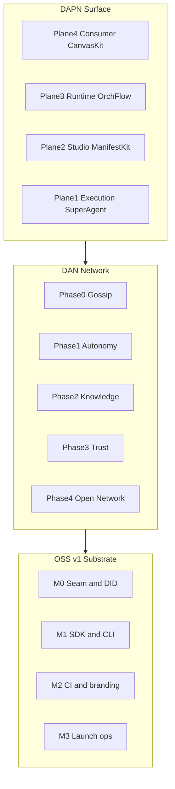

# Master plan — OSS, DAN, DAPN

**Single index** tying together the milestone systems used across Orcha docs. For layer definitions and SRS mapping, see [`SCOPE-MAP.md`](SCOPE-MAP.md).

---

## Stack (what we are building)

**Thesis:** OSS proves orchestration locally. DAN decentralizes discovery, memory, and trust. DAPN (with CanvasKit) turns agent output into applications users keep.

---

## Milestone crosswalk

### OSS launch (M0–M3)

| Milestone | Theme | Status | Doc |
|-----------|-------|--------|-----|
| **M0** | `ExecutionObserver` seam, `did:orcha:*`, emerge.yaml governance | Done | [`oss-launch/sprint-plan.md`](oss-launch/sprint-plan.md) |
| **M1** | `emerge` CLI/SDK, templates, docs funnel | Done | same |
| **M2** | README, CI, credential hygiene, ungate dev surfaces | Core done | same |
| **M3** | 5-min outsider test, carve, PyPI, Discord, demo | Owner-driven | same |

**Gate:** None external — ship when M3 checklist passes.

### Community inception (I0–I2)

| Phase | Exit criterion | Doc |
|-------|----------------|-----|
| **I0** | Launch gate passes on fresh clone | [`dan/CONTRIBUTOR-JOURNEY.md`](dan/CONTRIBUTOR-JOURNEY.md) |
| **I1** | ≥1 merged external PR | same |
| **I2** | ≥1 external sandbox agent OR two-machine gossip demo | same |

**Gate:** I2 exit unlocks **D0** engineering priority.

### DAN product phases (public)

| Phase | Adoption gate | Spec | Engineering IDs |
|-------|---------------|------|-----------------|
| **Phase 0 — Gossip** | ≥1 external agent (Day-30) | [`dan/phase-0-gossip.md`](dan/phase-0-gossip.md) | P0-1…P0-8, D0-4…D0-7 |
| **Phase 1 — Autonomy** | 10+ mesh agents | [`dan/phase-1-autonomy.md`](dan/phase-1-autonomy.md) | P1-1…P1-7 |
| **Phase 2 — Knowledge** | <5% autonomous failure | [`dan/phase-2-knowledge.md`](dan/phase-2-knowledge.md) | P2-1…P2-3 |
| **Phase 3 — Trust** | Coordinator untrusted at scale | [`dan/phase-3-trust.md`](dan/phase-3-trust.md) | P3-1…P3-4 |
| **Phase 4 — Open Network** | Legal review + community validators | [`ROADMAP.md`](../../ROADMAP.md) | P4 in [`dan/milestones.md`](dan/milestones.md) |
| **Chain / token** | All four criteria in INCEPTION | [`INCEPTION.md`](../../INCEPTION.md#chain--token-layer) | Blocked |

### DAN engineering sprints (internal D0–D3)

| Sprint | Maps to product phase | Focus | Doc section |
|--------|----------------------|-------|-------------|
| **D0** | Phase 0 | Signed manifests, gossip index, cross-machine invoke | CONTRIBUTOR-JOURNEY § Phase D0 |
| **D1** | Phase 1 *spike* | Validator observers, Kafka attestations, mock fee splits — **not** full autonomy | CONTRIBUTOR-JOURNEY § Phase D1 |
| **D2** | Phase 2 | LanceDB, knowledge gossip | CONTRIBUTOR-JOURNEY § Phase D2 |
| **D3** | Phase 3 + chain gates | Trustless settlement when four gates pass | CONTRIBUTOR-JOURNEY § Phase D3 |

Tracker detail: [`dan/milestones.md`](dan/milestones.md) · gaps: [`dan/gap-analysis.md`](dan/gap-analysis.md)

### DAPN four planes + five primitives

| Plane | What | Status | Primitive |
|-------|------|--------|-----------|
| **1 — Execution** | Request → response (SuperAgent today) | Built | — |
| **2 — Studio** | App Builder → AppManifest | Planned | ManifestKit |
| **3 — Runtime** | Always-on OrchFlow daemon | Planned | OrchFlow, AgentKey |
| **4 — Consumer** | Rendered application UI | **v0.1 building** | **CanvasKit**, ConnectKit |

Full specs: [`primitives/README.md`](primitives/README.md) · ROADMAP: [`ROADMAP.md`](../../ROADMAP.md#-dapn--decentralized-agentic-app-network)

**Gate:** CanvasKit v0.1 can ship on v1.x **without** DAN Day-30 gate. Planes 2–3 remain spec-only until SRS prioritizes them.

### Harness v1.2 (parallel, non-blocking)

| Item | Blocks launch? | Doc |
|------|----------------|-----|
| DAG executor, retry/fallback, semantic judging | No | [`ROADMAP.md`](../../ROADMAP.md) v1.2 |

---

## How OSS and DAN merge

1. **Runtime continuity** — Registry, PnD, SuperAgent, Gateway stay the execution core (Plane 1).
2. **Observer seam** — `ExecutionObserver.on_step_complete()`; OSS uses `NoOpObserver`; DAN adds `FulfillmentRecorder` and attestations without rewriting SuperAgent.
3. **Identity continuity** — `did:orcha:agent:*`, versioned `emerge.yaml`, `network.experimental` gate for spikes.
4. **Sequential gates** — No production libp2p or default-on gossip until Day-30 external agent signal (unless explicitly waived in SRS).

## How DAPN / CanvasKit fits

1. **Not a replacement** for OSS or DAN — it is the **consumer surface** (Plane 4).
2. **CanvasKit v0.1 on `main`** — agents emit `UIManifest` via `__canvas__` envelope → `canvas_manifest` SSE → `CanvasRenderer` in the frontend.
3. **Reference demo** — [`agents/finance-dashboard-agent/`](../../agents/finance-dashboard-agent/).
4. **Production path** — ConnectKit connectors for live data; earning model documented as roadmap-only in [`primitives/canvaskit.md`](primitives/canvaskit.md).

---

## Recommended reading order

1. [`README.md`](../../README.md) + [`ROADMAP.md`](../../ROADMAP.md) — public trajectory
2. [`INCEPTION.md`](../../INCEPTION.md) — DAN thesis
3. [`oss-launch/sprint-plan.md`](oss-launch/sprint-plan.md) — launch checklist (internal)
4. [`dan/gap-analysis.md`](dan/gap-analysis.md) — built vs missing
5. [`primitives/README.md`](primitives/README.md) — DAPN + CanvasKit

---

## Development gate summary

| Work track | Start when |
|------------|------------|
| OSS M3 launch | Now (owner-driven) |
| CanvasKit v0.1 hardening + finance demo | Now (on `main`) |
| DAN Phase 0 libp2p production | Day-30 external agent **or** SRS waiver |
| DAPN Planes 2–3 (Studio, OrchFlow daemon) | After SRS prioritization |
| Chain / token | All four INCEPTION criteria |
