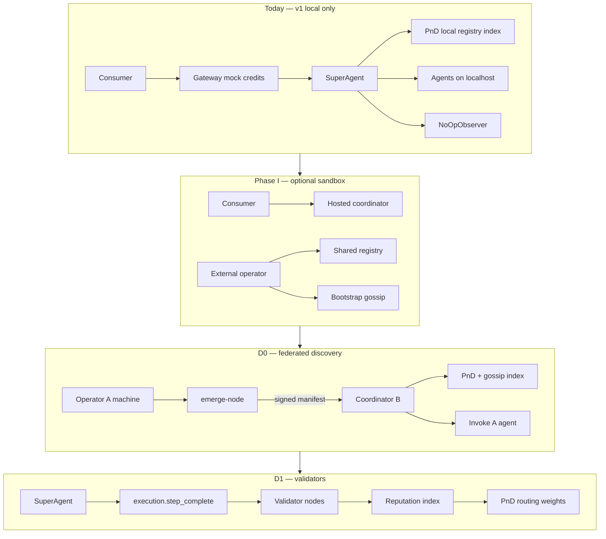
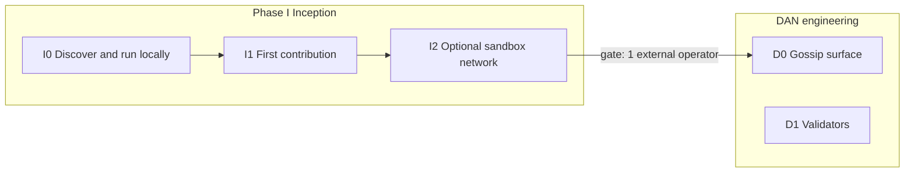
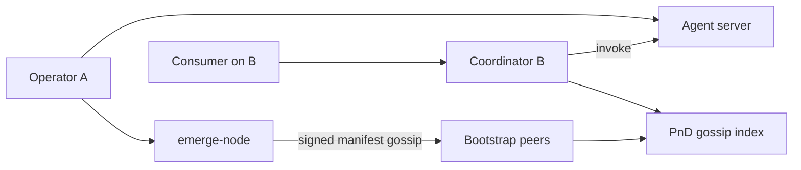
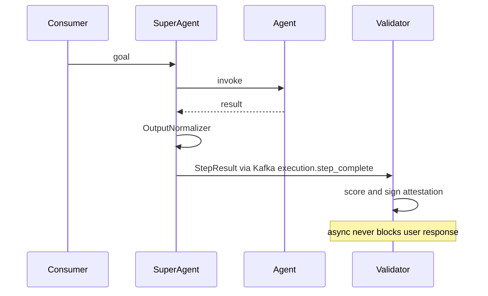
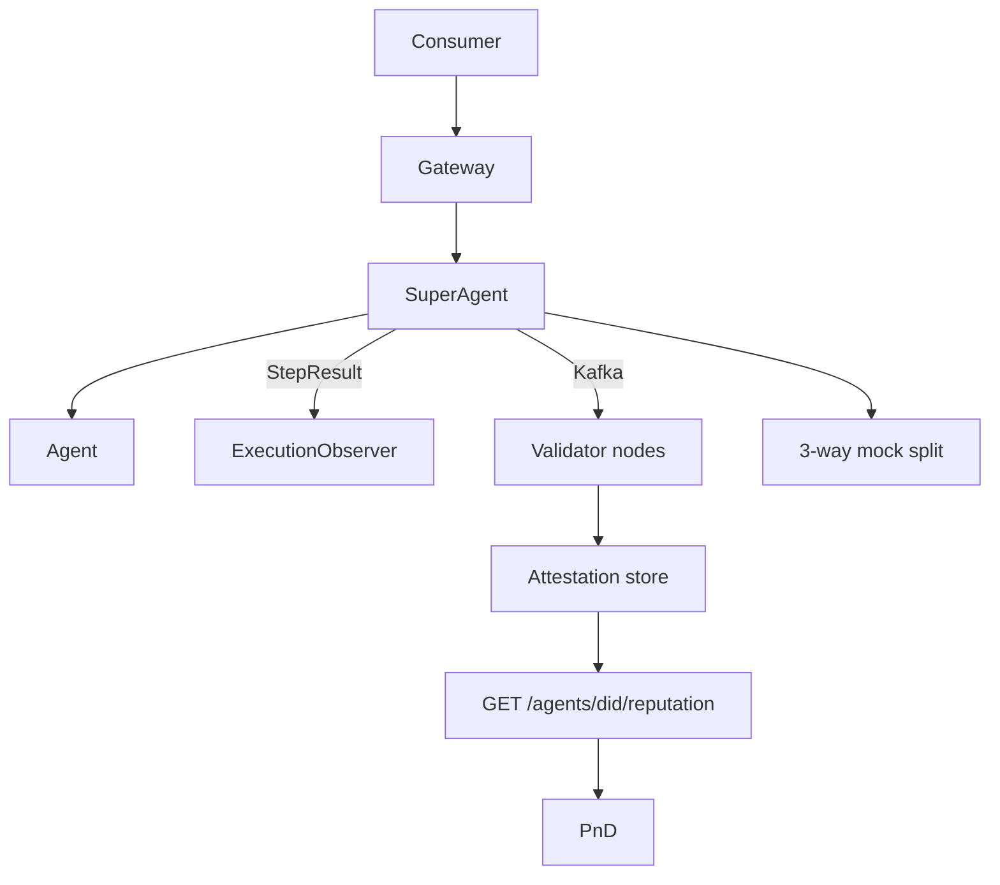

# Contributor journey — Phase I (Inception)

Internal execution doc: how the **network**, **users**, **maintainers**, and **repo** evolve together.

Public entry: [`../../join.md`](../../join.md). Thesis: [`../../../INCEPTION.md`](../../../INCEPTION.md). PDF: [`../EmergeOS-DAN.pdf`](../EmergeOS-DAN.pdf). Milestones: [`milestones.md`](milestones.md). **Unified index:** [`../MASTER-PLAN.md`](../MASTER-PLAN.md).

### Naming: Phase 0–4 vs D0–D3

| Public name | Engineering sprint | Notes |
|-------------|-------------------|-------|
| Phase 0 — Gossip | **D0** | Discovery, signed manifests, gossip index |
| Phase 1 — Autonomy | **D1** *spike only* | Validators/attestations spike — **not** full `@autonomous` loop (see [`gap-analysis.md`](gap-analysis.md)) |
| Phase 2 — Knowledge | **D2** | LanceDB, knowledge gossip |
| Phase 3 — Trust | **D3** | PoF, chain — only if four gates pass |
| Phase 4 — Open Network | *(post-D3)* | See [`ROADMAP.md`](../../../ROADMAP.md) |

Deliverable IDs **P0–P4** live in [`milestones.md`](milestones.md). OSS launch uses **M0–M3** ([`../oss-launch/sprint-plan.md`](../oss-launch/sprint-plan.md)).

---

## Network structure at a glance (today vs target)



---

## Phase 0 — Today (v1 substrate)

Before inception gates. What the repo **actually does** for a random GitHub visitor.

### Network shape

Single machine (or manual URL wiring). One **coordinator stack** on localhost:

| Component | Role |
|---|---|
| Registry `:8000` | Agent catalog on *your* Postgres |
| PnD `:8001` | Semantic discovery over *local* registry |
| SuperAgent `:8002` | Plan + execute + mock settlement |
| Gateway `:8080` | Auth, sessions, mock `credits_usd` |
| Agents | Example fleet in `agents/` or `emerge run` |

There is **no shared network** between strangers. Gossip/validator code exists as **spikes**, not in the default user path.

### Maintainer journey

| You do | Why |
|---|---|
| Keep `main` green (launch gate, CI) | First impression = trust |
| `./scripts/run-all.sh` works on clean clone | Proves “this isn’t vapor” |
| Answer Discord / review agent & bridge PRs | Converts visitors → contributors |
| **Do not** promise network participation yet | Honest positioning in README/VISION |

### User journeys by role

**Visitor / curious dev**

1. Read README → VISION → ROADMAP
2. `git clone` → `./scripts/run-all.sh` → `emerge init && emerge run`
3. Chat in UI or `make chat` — SuperAgent routes to **local** agents

| Can do | Cannot do |
|---|---|
| Run full orchestration locally (MCP/A2A/ACP) | Discover someone else’s agent automatically |
| Register agents to **local** registry | Earn real money |
| Mock credits, mock per-call fees | Join a public DAN / gossip network |
| Fork and ship their own stack | Get reputation that travels with them |

**Agent operator**

- `emerge run` / `emerge publish --registry http://localhost:8000`
- Agent visible only to **their** coordinator

**Coordinator operator**

- Runs `./scripts/run-all.sh` — they **are** the whole network on one laptop

**Validator**

- `emerge validate --once` → prints a **synthetic** demo attestation
- No live stream, no fee share in practice unless they manually set env vars on SuperAgent

**Consumer**

- Frontend + mock 5000 credits
- Chooses agents by PnD semantic match + local metrics — **not** validator consensus

### Repo capability vs wired (Phase 0)

| Feature | In repo? | In default user path? |
|---|---|---|
| Multi-protocol orchestration | Yes | Yes |
| `emerge.yaml` + DID | Yes | Yes |
| Mock payments / settlement | Yes | Yes |
| `ExecutionObserver` seam | Yes | Yes (NoOp) |
| Signed envelopes (`node/`) | Spike | No |
| TCP gossip (`emerge-node`) | Spike | No |
| Kafka `execution.step_complete` | Spike | Only if `KAFKA_ENABLED=true` |
| `FulfillmentRecorder` | Spike | No (not injected by default) |
| Three-way fee split | Spike | Only via env BPS on SuperAgent |
| Reputation API | No | No |
| Hosted sandbox | No | No |

**Growth signal:** stars, clones, “I got it running” in Discord. Network size = **1 coordinator per user**.

---

## Phase I — Inception (first 1–3 external devs)

Goal: turn clones into **participants**, not just readers. Mostly local; optional **hosted sandbox** (local-first default).



### I0 — Discover and run

**Network shape:** Same as v1. No new infra required.

**Entry paths (ordered by friction):**

1. GitHub README → [`docs/quickstart.md`](../../quickstart.md) → `./scripts/run-all.sh`
2. Issue templates: bridge / agent / bug (`.github/ISSUE_TEMPLATE/`)
3. Discord for unblock, not primary docs

**Maintainer journey**

- Public [`docs/join.md`](../../join.md): one page, role picker
- Label 5–8 good-first issues
- Launch gate always green ([`launch-gate-smoke.md`](../launch-gate-smoke.md))

**External dev journey**

1. Same as v1 quickstart
2. Pick a role in Discord / Discussion: agent, bridge, validator-curious

| Can do | Cannot do |
|---|---|
| Prove they can run the stack | Publish to a shared public network (yet) |
| Open agent/bridge PRs | Change core engine without RFC |

**Tech to build:** docs + GitHub hygiene (Discussions, CODEOWNERS, good-first issues). **No protocol code required.**

**I0 exit gate:** Launch gate passes on a fresh clone.

---

### I1 — First contribution

**Network shape:** Still local per contributor. Your registry is not their registry unless they point at you.

**Designed paths (no core-engine surprise PRs):**

| Path | Entry | Review surface |
|---|---|---|
| **Agent** | `emerge init` + example in `agents/` | Manifest + handler only |
| **Bridge** | New protocol adapter | [`docs/bridges.md`](../../bridges.md) |
| **Validator spike** | `emerge validate --once` | `services/validator/` tests |
| **Gossip spike** | Two-peer test | `node/tests/` |

**Maintainer journey**

- Review and merge low-risk PRs (agents, bridges, tests, docs)
- Route core changes through issues + RFC ([`docs/spec/governance.md`](../../spec/governance.md))
- CODEOWNERS on `services/superagent/`, `docs/spec/`, `sdk/`

**Good first issues (backlog):**

- Wire `emerge publish` to sign manifests (`node/src/emerge_node/envelope.py`)
- Registry: verify signature on ingest (D0-5)
- `emerge validate` Kafka consumer (`execution.step_complete`)
- Reputation API stub: `GET /agents/{did}/reputation`
- Docs: one bridge walkthrough GIF in `docs/assets/`

| Can do | Cannot do |
|---|---|
| Ship agent/bridge/test PRs | Affect global discovery |
| Spike DAN modules locally | Break `emerge.yaml` without RFC |

**Tech to build:** nothing blocking — backlog items above.

**I1 exit gate:** **≥1 merged external PR** OR maintainer-approved “robust account” demo (registered agent + public fork with green CI).

**→ Triggers D0 hardening sprint.**

---

### I2 — Optional hosted sandbox (local-first + opt-in sandbox)

**Default:** every dev runs [`docs/setup.md`](../../setup.md) / quickstart on their machine.

**Sandbox (opt-in for early adopters):**

1. Dev completes I0 locally
2. Applies via GitHub Discussion: GitHub handle, agent DID intent, role (operator / validator)
3. Maintainer issues: `SANDBOX_BOOTSTRAP=<host:port>`, read-only registry URL, mock credits cap
4. Dev runs: `emerge publish --registry <sandbox> --network <bootstrap>` (once D0-4/5 land)

**Network shape (two-tier):**

```
[Your hosted coordinator]  ←── bootstrap gossip, shared registry (allowlisted)
        ↑
[External operator A]  — publish agent, capped mock credits
[External operator B]  — consumer OR second coordinator (read-only federated)
```

**Hosted vs OSS (sandbox v1):**

| Component | OSS | Hosted sandbox |
|---|---|---|
| Runtime stack | Full clone | Your coordinator instance |
| Bootstrap gossip hub | `emerge-node` OSS | 1–3 bootstrap peers you operate |
| Production USDC / Privy | Interface only | Never in sandbox v1 |
| Reputation index | API spec + mock | Live attestation store |

**Agent operator (sandbox)**

| Can do | Cannot do |
|---|---|
| Agent on **shared** test network | Permissionless join (allowlist) |
| Mock earnings on sandbox ledger | Real USDC |
| Show portfolio / reputation seed | Portable reputation to another fork (yet) |

**Consumer (sandbox)**

- Use **your** frontend / coordinator UI
- Discover sandbox agents via PnD (local + gossip-fed when D0-6 lands)

**Validator (sandbox, early)**

| Can do | Cannot do |
|---|---|
| Demo validator role | Trustless validator payouts |
| Earn mock validator share (env BPS) | Slash / stake enforcement |

**Tech to build (priority order):**

1. D0-4: `emerge publish --network`
2. D0-5: Registry signature verify
3. D0-6: PnD gossip manifest index
4. Hosted bootstrap deployment (not in OSS repo)
5. Sandbox onboarding flow (Discussions + env injection)

**I2 exit gate:** **≥1 external agent** on sandbox OR **two-machine local demo** (operator A + coordinator B) using gossip spike.

**→ Triggers D0 hardening sprint.**

---

## Phase D0 — Network surface

**Outcome:** Machine B discovers and invokes Machine A’s agent **without URL copy-paste**.

D0 is **discovery**, not economics. Public story: **reputation-first** (invocations, success rate, discoverability); mock fees optional for settlement rehearsal.

### Network shape



**Federated, not fully decentralized:** bootstrap peers are **trusted** (maintainer first, community later). Coordinator still plans/routes.

### Maintainer journey

- Ship D0-4 → D0-7 in order (sign, verify, PnD index, then libp2p swap)
- Run canonical bootstrap; document “official” bootstrap URLs
- Onboard 2–3 operators into **real** two-machine demos

### User journeys

**Agent operator**

```bash
emerge run --network bootstrap.orcha.dev   # future
emerge publish --registry <coord> --network bootstrap.orcha.dev
```

| Can | Cannot |
|---|---|
| Agent discoverable across coordinators | Autonomous intent broadcast (PDF Phase 1) |
| Cryptographic identity on manifest | Permissionless bootstrap (allowlist early) |
| Proto-reputation: execution_count, success_rate | Chain / token |
| Optional mock fees (off critical path) | Real USDC |

**Coordinator operator**

- Self-host stack **or** use hosted sandbox
- Point PnD at bootstrap; ingest signed gossip manifests
- **Read** federated agents; still **trusted** routing

**Consumer**

- Natural-language goal on coordinator B
- PnD finds operator A’s agent **automatically**

**Validator**

- Still minimal — D0 is about **discovery**, not attestation trust

### Tech to build

| ID | Work | Status |
|---|---|---|
| D0-4 | SDK `--network` publishes to gossip | Not started |
| D0-5 | Registry verifies Ed25519 on ingest | Not started |
| D0-6 | PnD indexes remote manifests | Not started |
| D0-7 | AC: machine B invokes A | Not started |
| Later | libp2p GossipSub replaces TCP spike | TBD |

Spec: [`phase-0-gossip.md`](phase-0-gossip.md).

**D0 exit gate:** External operator completes AC-D0 without maintainer SSH access.

**Growth signal:** agent count on bootstrap **> maintainers’ agents**; coordinators beyond yours indexing gossip.

---

## Phase D1 — Validator layer

**Outcome:** Third parties observe executions, attest quality, earn mock fee share; routing considers reputation.

**Validating here ≠ blockchain validation.** Validators are **third-party observers** of completed agent runs — distributed **observability**, not inline gatekeeping.



They observe **`StepResult`** after the run: call id, agent id, success, latency, output snippet. Reference: [`FulfillmentRecorder`](../../../services/validator/src/validator/recorder.py) → attestation with `judge_score` (0–1).

### Reputation vs validator share (pre-token)

| Mechanism | Purpose | Pre-token form |
|---|---|---|
| **Attestation / `judge_score`** | Trust for routing | Reputation API |
| **Validator share (`validator_share_bps`)** | Pay observer for work | Mock ledger / log |
| **Agent share of `base_fee`** | Pay operator | Mock `developer_payout` |
| **Mock consumer debit** | Pay for call | `credits_usd` |

Reputation answers: *“Should I route to this agent?”*  
Validator share answers: *“Who gets paid for observing?”*

Example split on `base_fee = $0.10`:

```
coordinator_share_bps: 1000  → $0.01
validator_share_bps:    500  → $0.005
agent operator:              → $0.085
```

### Network shape



### How someone becomes a validator (D1 OSS)

1. Get a validator DID — e.g. `did:orcha:validator:alice` (ties to D0 signing)
2. Run `emerge validate` subscribing to `execution.step_complete` (live consumer; today `--once` demo only)
3. Connect to coordinator Kafka — `KAFKA_ENABLED=true` on SuperAgent
4. Sandbox: allowlist validator DIDs early

No stake, no chain, no permissionless registry in D1.

### Maintainer journey

- Require D0 signed identity for production attestations
- Ship live `emerge validate` Kafka consumer
- Ship reputation API + PnD weighting
- Onboard first **external validator** on sandbox

### User journeys

**Validator**

| Can | Cannot |
|---|---|
| Observe real executions (async) | Block user-facing latency |
| Publish signed attestations | Forge others’ agent identity (without D0 keys) |
| Earn mock validator share | Trustless slash / stake |
| Influence discovery via reputation | Semantic judge at scale (D2) |

**Agent operator**

| Can | Cannot |
|---|---|
| Build reputation via validator consensus | Hide bad execution from observers |
| Higher routing if scores good | Buy reputation without attestations |

**Consumer**

| Can | Cannot |
|---|---|
| See reputation on agents | On-chain escrow |
| Pay base + validation fee (mock) | Permissionless coordinator-less routing |

**Coordinator**

| Can | Cannot |
|---|---|
| Take `coordinator_share_bps` | Monopolize validator data (OSS fan-out) |

### Tech to build

| Item | Status today |
|---|---|
| Kafka fan-out | Spike — needs live validator consumer |
| `FulfillmentRecorder` | Reference impl exists |
| Fee split in settlement | Spike via env vars |
| Reputation API | Not started |
| PnD routing + reputation | Not started |
| Attestation DB migration | Not started |

Spec: [`phase-1-autonomy.md`](phase-1-autonomy.md).

**D1 entry gate:** D0 signed identity in production path.

**D1 exit gate:** ≥1 external validator attestation in reputation index; fee splits visible in mock ledger.

---

## Phase D2 — Knowledge propagation

**Outcome:** Agents learn from network experience, not just single-call state.

Local LanceDB/sqlite-vec per agent + gossip `KNOWLEDGE_BROADCAST` (PDF). Merges with v1.2 Harness semantic judge — one judge system.

| Can (target) | Cannot (target) |
|---|---|
| Query collective domain knowledge | Central global knowledge graph |
| Auto-share high-confidence fragments | Encrypted domain keys at scale (hard P2P) |

Spec: [`phase-2-knowledge.md`](phase-2-knowledge.md). Implementation: not started.

**Growth signal:** cross-operator knowledge queries; routing improvement from shared fragments.

---

## Phase D3 — Trustless settlement

**Outcome:** Chain/token **only if** all four gates pass ([`phase-3-trust.md`](phase-3-trust.md), [`INCEPTION.md`](../../../INCEPTION.md#chain--token-layer)).

| Role | Can (eventually) | Cannot (until gates) |
|---|---|---|
| Anyone | Permissionless agent registration on-chain | Token launch before gates |
| Validator | Stake + slash + block rewards (PoF thesis) | N/A pre-gates |
| Operator | Trustless payout | Rely on custodial wallet |

**Maintainer journey:** Re-evaluate gates Day-90 post-D1; no chain engineering before that.

---

## Timeline — how the network grows

| Phase | Network size | Who joins | What spreads |
|---|---|---|---|
| **v1 today** | N isolated laptops | Cloners | Stars, “it runs” |
| **I0–I1** | Same + Discord/PRs | 1–3 contributors | Agents, bridges, trust in maintainers |
| **I2 sandbox** | 1 shared testnet you operate | Allowlisted operators | First **external** agents on **one** graph |
| **D0** | Multi-coordinator federation | Independent operators + coordinators | Signed manifests, cross-machine discovery |
| **D1** | Operators + validators | Validator nodes | Attestations, reputation, fee splits |
| **D2** | Knowledge mesh | Domain specialists | Shared learnings, better routing |
| **D3** | Permissionless economy | Anyone | Stakes, trustless settlement |

---

## Maintainer vs user (summary)

| Phase | Maintainer | User feels |
|---|---|---|
| **v1** | Stable local runtime, honest docs | “Powerful local orchestrator” |
| **I0** | Docs, CI, community entry | “I can run this in an afternoon” |
| **I1** | Merge contributions, RFC discipline | “I can ship something real” |
| **I2** | Hosted sandbox + allowlist | “I’m on **a** network, not alone” |
| **D0** | Bootstrap + federated discovery | “My agent is findable without my URL” |
| **D1** | Validators + reputation | “Quality is observed and rewarded” |
| **D2** | Knowledge layer | “The network gets smarter” |
| **D3** | Chain when deserved | “I don’t need to trust one company” |

---

## Copy-paste / outperform concern (per phase)

| Phase | What a copier gets | What they **don’t** get by copying GitHub |
|---|---|---|
| v1 | Full runtime fork | Your users, bootstrap, reputation graph |
| I2+ | Same code + sandbox URL if issued | Allowlist control, operational excellence |
| D0+ | Fork + their own bootstrap | Agents/reputation on **your** canonical network |
| D1+ | Validator code | Historical attestations tied to DIDs on live network |
| D3 | Chain spec | Genesis community, validator set, liquidity |

The moat grows **with the network graph**, not with hidden code. Inception moves people from copying code to **participating on your graph** before they fork.

---

## Phase gates (quick reference)

| Gate | Criterion |
|---|---|
| I0 exit | Launch gate passes on fresh clone |
| I1 exit | ≥1 merged external PR or robust-account demo |
| I2 exit | ≥1 external sandbox agent OR two-machine gossip demo |
| D0 entry | I2 gate passed |
| D0 exit | External operator completes AC-D0 without maintainer SSH |
| D1 entry | D0 signed identity in production path |
| D1 exit | ≥1 external validator in reputation index; mock fee splits visible |
| D3 entry | All four gates in [`phase-3-trust.md`](phase-3-trust.md) / [`INCEPTION.md`](../../../INCEPTION.md#chain--token-layer) |
