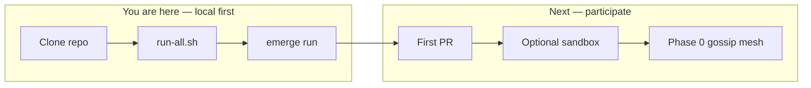
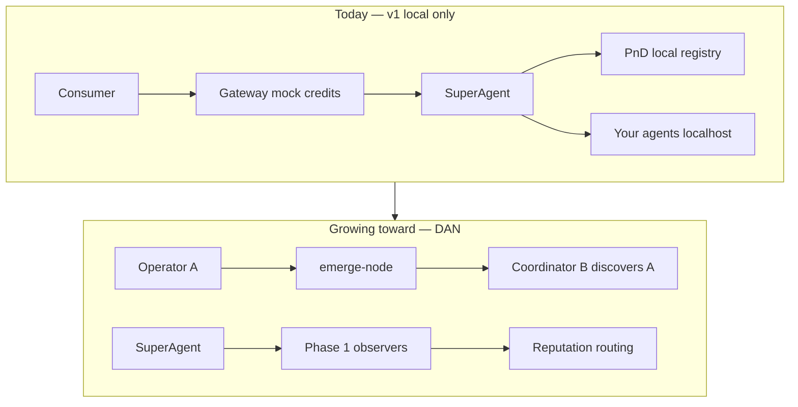

# Join Orcha

**Open agent orchestration → Decentralized Agent Network (DAN).**

Not a better model. A better way to **use**, **route**, **observe**, and **distribute** agents across MCP, A2A, and ACP.

→ Thesis: [`INCEPTION.md`](../INCEPTION.md) · Roadmap: [`ROADMAP.md`](../ROADMAP.md) · Quickstart: [`quickstart.md`](quickstart.md)

---

## Where you are in the journey





**Today:** one laptop = one network. **Tomorrow:** agents discover each other (Phase 0), act autonomously (Phase 1), share knowledge (Phase 2), trustless settlement when earned (Phase 3). DAN spikes require `network.experimental: true` until the Day-30 gate.

---

## Pick your role

| Role | You run | Today | Coming |
|---|---|---|---|
| **Curious dev** | Clone + quickstart | Full local orchestration | — |
| **Agent operator** | `emerge run` / `publish` | Register on **your** registry | Gossip publish (Phase 0) |
| **Coordinator** | `./scripts/run-all.sh` | Whole stack on localhost | Federated bootstrap |
| **Validator / observer** | `emerge validate --once` | Demo attestation (experimental) | Phase 1 live observer |
| **Consumer** | UI or `make chat` | Mock credits | Reputation-aware routing |

Maintainer journey: [`dev_docs/dan/CONTRIBUTOR-JOURNEY.md`](dev_docs/dan/CONTRIBUTOR-JOURNEY.md)

---

## Step 1 — Run it locally (~5 min)

```bash
git clone git@github.com:azank1/orcha.git && cd orcha
make install
cp services/superagent/.env.example services/superagent/.env
# add OPENROUTER_API_KEY to services/superagent/.env
./scripts/run-all.sh
emerge init demo && cd demo && emerge run
```

| Can do now | Cannot do yet |
|---|---|
| Orchestrate MCP + A2A + ACP in one run | Auto-discover someone else's agent |
| Register agents on local registry | Public gossip (pre Day-30 gate) |
| Mock credits, full payment plumbing | Production DAN without `experimental` |
| Run DAN spikes locally with env opt-in | Portable reputation across forks |

→ [`quickstart.md`](quickstart.md) · [`setup.md`](setup.md)

---

## Step 2 — Contribute

No RFC needed for agents, bridges, or experimental DAN tests in `node/` / `services/validator/`.

Core engine + `emerge.yaml` changes need an issue first → [`CONTRIBUTING.md`](../CONTRIBUTING.md)

**Goal:** ≥1 merged PR → team continues Phase 0 hardening behind `experimental`.

---

## Step 3 — Optional sandbox (early adopters)

Local first. Sandbox is opt-in after quickstart works. Request via GitHub Discussions → allowlisted bootstrap + registry.

---

## What each phase unlocks

| Phase | Gate | Network |
|---|---|---|
| **v1 now** | — | Your laptop only |
| **Inception** | Run + contribute | Local + community |
| **Phase 0 — Gossip** | ≥1 external agent (Day-30) | Cross-machine discovery |
| **Phase 1 — Autonomy** | 10+ mesh agents | Observers + `@autonomous` |
| **Phase 2 — Knowledge** | <5% autonomous failure | Shared learnings |
| **Phase 3 — Trust** | Coordinator distrusted at scale | PoF + settlement preview |
| **Phase 4 — Open** | Legal + community ready | Chain mainnet |

Full detail: [`ROADMAP.md`](../ROADMAP.md) · [`INCEPTION.md`](../INCEPTION.md)

---

## Pre-token economics

| Phase | Money | Trust |
|---|---|---|
| **Phase 0** | Optional mock credits | Reputation-first (invocations, success rate) |
| **Phase 1** | Mock observer fees (preview) | Attestations + `judge_score` |
| **Phase 3+** | USDC → chain when gated | On-chain reputation |

---

## Help

- [Discord](https://discord.gg/orcha)
- [`SECURITY.md`](../SECURITY.md) for vulnerabilities

```bash
make check
```
