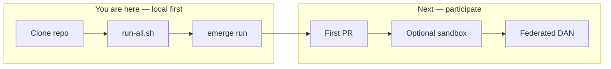
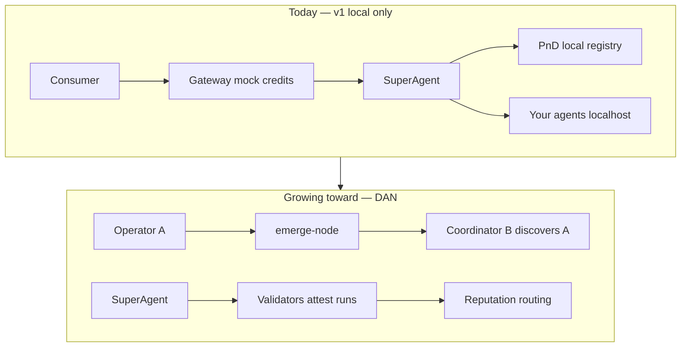

# Join Orcha

**Open agent orchestration → Decentralized Agent Network (DAN).**

Not a better model. A better way to **use**, **route**, **observe**, and **distribute** agents across MCP, A2A, and ACP.

→ Vision: [`VISION.md`](../VISION.md) · Roadmap: [`ROADMAP.md`](../ROADMAP.md) · Quickstart: [`quickstart.md`](quickstart.md)

---

## Where you are in the journey





**Today:** one laptop = one network. **Tomorrow:** agents discover each other; validators attest quality; reputation drives routing. No chain, no token until the network earns it.

---

## Pick your role

| Role | You run | Today | Coming |
|---|---|---|---|
| **Curious dev** | Clone + quickstart | Full local orchestration | — |
| **Agent operator** | `emerge run` / `publish` | Register on **your** registry | Gossip publish · discoverability |
| **Coordinator** | `./scripts/run-all.sh` | Whole stack on localhost | Federated bootstrap |
| **Validator** | `emerge validate` | `--once` demo attestation | Live observer · mock fee share |
| **Consumer** | UI or `make chat` | Mock credits | Reputation-aware routing |

Internal journey detail (maintainers): [`dev_docs/dan/INCEPTION.md`](dev_docs/dan/INCEPTION.md)

---

## Step 1 — Run it locally (~5 min)

```bash
git clone git@github.com:azank1/orcha.git && cd orcha
make install
cp services/superagent/.env.example services/superagent/.env
# add OPENROUTER_API_KEY to services/superagent/.env
./scripts/run-all.sh
emerge init demo && cd demo && emerge run
```

| Can do now | Cannot do yet |
|---|---|
| Orchestrate MCP + A2A + ACP in one run | Auto-discover someone else’s agent |
| Register agents on local registry | Earn real money |
| Mock credits, full payment plumbing | Join a public gossip network |
| Fork the entire runtime | Portable reputation across forks |

→ [`quickstart.md`](quickstart.md) · [`setup.md`](setup.md) for manual service setup

---

## Step 2 — Contribute (first external devs)

No RFC needed for:

- **Agents** — [`templates/your-first-agent/`](../templates/your-first-agent/)
- **Bridges** — [`docs/bridges.md`](bridges.md)
- **DAN spikes** — gossip tests in `node/`, validator in `services/validator/`

Core engine + `emerge.yaml` spec changes need an issue first → [`CONTRIBUTING.md`](../CONTRIBUTING.md)

| Can do | Cannot do |
|---|---|
| Ship agent/bridge/test PRs | Change spec without RFC |
| Run DAN spikes locally | Affect global discovery (pre-D0) |

**Goal:** ≥1 merged PR → unlocks D0 hardening sprint.

---

## Step 3 — Optional sandbox (early adopters)

**Default stays local.** Sandbox is opt-in after you prove I0 (stack runs on your machine).

1. Complete quickstart locally
2. Request access via GitHub Discussions (handle, role, agent DID intent)
3. Receive bootstrap URL + sandbox registry (allowlisted, mock credits cap)
4. Publish agent to **shared test network** (once D0 publish path ships)

| Can do on sandbox | Cannot do |
|---|---|
| Agent on shared test network | Permissionless join |
| Build reputation seed | Real USDC |
| Demo validator role (D1) | Trustless stake/slash |

---

## What each phase unlocks (public)

| Phase | Network | You feel |
|---|---|---|
| **v1 now** | Your laptop only | “It runs — I orchestrate agents” |
| **Inception** | Local + community | “I shipped something” |
| **D0** | Cross-machine discovery | “My agent is findable without my URL” |
| **D1** | Validators + reputation | “Quality is observed and rewarded” |
| **D2** | Shared knowledge | “The network gets smarter” |
| **D3** | Trustless settlement | “No single company owns trust” |

Full phase tables: [`ROADMAP.md`](../ROADMAP.md)

---

## Pre-token economics (plain language)

| Phase | Money | Trust |
|---|---|---|
| **D0** | Optional mock credits | **Reputation-first:** invocations, success rate, discoverability |
| **D1** | Mock fee split (agent / validator / coordinator) | **Attestations** with `judge_score` drive routing |
| **D3+** | Real USDC (hosted) → chain when gated | On-chain reputation when network demands it |

Mock credits rehearse plumbing. Reputation rehearses **who to trust**. They stay separate on purpose.

---

## Help & community

- **Questions:** [Discord](https://discord.gg/orcha) (fastest)
- **Bugs / bridges / agents:** GitHub issue templates
- **Security:** [`SECURITY.md`](../SECURITY.md) — never public issues for vulns

```bash
make check   # before opening a PR
```
