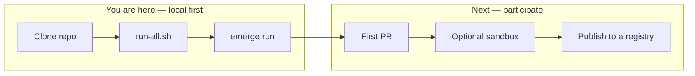
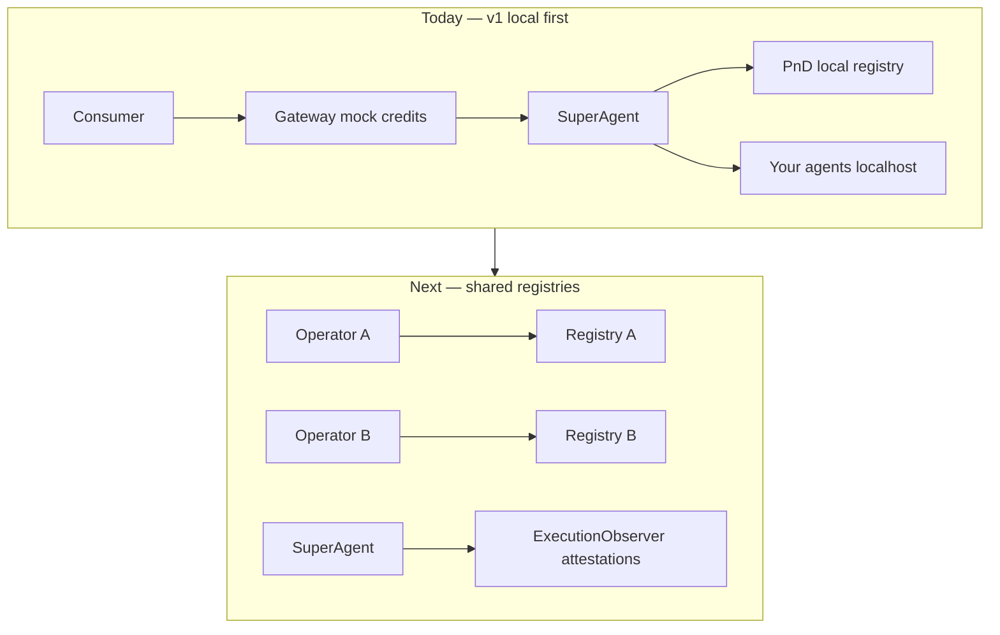

# Join Orcha

**Open agent orchestration — one goal, many agents, any protocol.**

Not a better model. A better way to **use**, **route**, **observe**, and **distribute** agents across MCP, A2A, and ACP.

→ Roadmap: [`ROADMAP.md`](../ROADMAP.md) · Quickstart: [`quickstart.md`](quickstart.md)

---

## Where you are in the journey





**Today:** one laptop runs the whole stack. **Next:** shared registries, observer
attestations via the `ExecutionObserver` seam, and reputation-aware routing as
adoption earns each layer.

---

## Pick your role

| Role | You run | Today | Coming |
|---|---|---|---|
| **Curious dev** | Clone + quickstart | Full local orchestration | — |
| **Agent operator** | `emerge run` / `publish` | Register on **your** registry | Publish to shared registries |
| **Coordinator** | `./scripts/run-all.sh` | Whole stack on localhost | Hosted sandbox operations |
| **Validator / observer** | `emerge validate --once` | Demo attestation | Live observer via the ExecutionObserver seam |
| **Consumer** | UI or `make chat` | Mock credits | Reputation-aware routing |

---

## Step 1 — Run it locally (~5 min)

```bash
git clone git@github.com:azank1/orcha.git && cd orcha
make install
cp services/superagent/.env.example services/superagent/.env
# add OPENROUTER_API_KEY to services/superagent/.env
./scripts/run-all.sh
emerge init demo && cd demo && emerge run
```

| Can do now | Cannot do yet |
|---|---|
| Orchestrate MCP + A2A + ACP in one run | Auto-discover someone else's agent |
| Register agents on local registry | Publish to a shared public registry |
| Mock credits, full payment plumbing | Live settlement |
| Run observer attestations locally with env opt-in | Portable reputation across deployments |

→ [`quickstart.md`](quickstart.md) · [`setup.md`](setup.md)

---

## Step 2 — Contribute

No RFC needed for agents, bridges, or experimental observer/attestation work in `node/` / `services/validator/`.

Core engine + `emerge.yaml` changes need an issue first → [`CONTRIBUTING.md`](../CONTRIBUTING.md)

**Goal:** ≥1 merged PR — bridges and agents are the highest-leverage contributions.

---

## Step 3 — Optional sandbox (early adopters)

Local first. Sandbox is opt-in after quickstart works. Request via GitHub Discussions.

---

## Help

- [Discord](https://discord.gg/orcha)
- [`SECURITY.md`](../SECURITY.md) for vulnerabilities

```bash
make check
```
