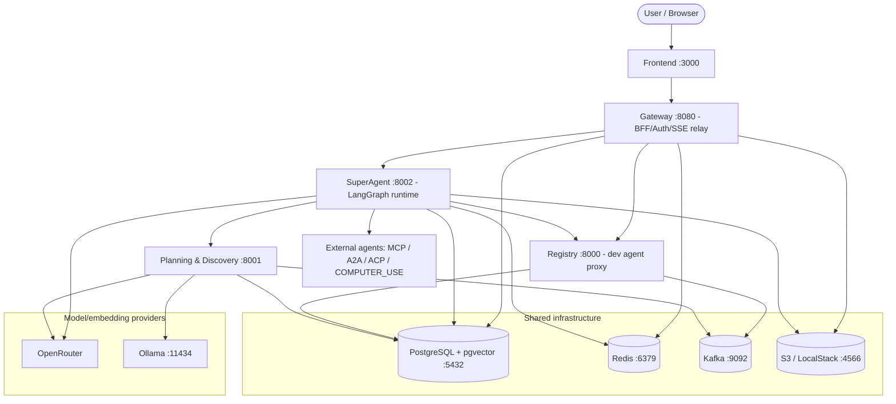
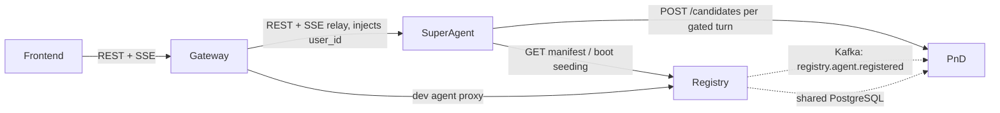

# Orcha — Software Requirements Specification (As-Built)

> **Document type:** As-built engineering reference (not a forward-looking design doc).
> **Status:** Current as of 2026-07-14, reflecting the state of `main`.
> **Audience:** Software engineers onboarding onto Orcha who need the system's true internals — stack, architecture, data model, interfaces, and non-functional posture — to assess and extend it.
>
> This document describes **what exists and runs today**. It deliberately excludes roadmap / not-yet-built features. The single exception is [Section 8](#8-extensibility--design-seams), which documents *existing code seams* that a future network layer would attach to — framed strictly as "hooks that exist now," not as descriptions of unbuilt systems.
>
> Where this document and older docs disagree, **this document is authoritative** (see [Section 7.6, Known Documentation Drift](#76-known-documentation-drift)).

---

## Table of Contents

1. [Introduction](#1-introduction)
2. [System Overview](#2-system-overview)
3. [Architecture — Service by Service](#3-architecture--service-by-service)
4. [Data Architecture](#4-data-architecture)
5. [External Interfaces](#5-external-interfaces)
6. [Functional Capabilities](#6-functional-capabilities)
7. [Non-Functional Characteristics](#7-non-functional-characteristics)
8. [Extensibility — Design Seams](#8-extensibility--design-seams)
9. [Appendices](#9-appendices)

---

## 1. Introduction

### 1.1 Purpose

Orcha is an open-source, multi-protocol AI agent orchestration runtime. A user submits a single free-text goal; Orcha decomposes it into a plan of agent calls that may span **different agent protocols** (MCP, A2A, ACP, COMPUTER_USE), executes them, verifies the results, and renders the output as a **live dashboard (CanvasKit)** rather than a wall of chat text.

This SRS is the authoritative, code-accurate description of the system as it is actually built.

### 1.2 Scope

In scope: the four backend services, the frontend, the `emerge` SDK, the agent fleet, shared/common packages, the data model, all external interfaces (REST, gRPC, SSE, Kafka), and the deployment/testing posture — all as currently implemented.

Out of scope: network-layer plans and token/chain economics. These are intentionally omitted except for the bounded extensibility note in Section 8.

### 1.3 Definitions & Acronyms

| Term | Meaning |
|---|---|
| **MCP** | Model Context Protocol — a tool-call protocol for connecting a model/agent to tools. Transports used here: SSE, STDIO. |
| **A2A** | Agent-to-Agent protocol — HTTP/JSON-RPC task lifecycle between independent agents. |
| **ACP** | Agent Communication Protocol — accepted as a compatibility alias; routed through the A2A handler at runtime (IBM's ACP merged into A2A upstream). |
| **COMPUTER_USE** | Protocol family for GUI/desktop automation agents; ships with a mock backend by default. |
| **DID** | Decentralized Identifier. Orcha namespace: `did:orcha:agent:<id>` (user agents) and `did:orcha:system:<id>` (platform tools). |
| **SSE** | Server-Sent Events — the streaming transport from SuperAgent → Gateway → browser. |
| **PnD** | Planning & Discovery service. |
| **CanvasKit** | Orcha's declarative UI protocol: agents emit a `UIManifest` (structured JSON), the frontend renders it with curated React components. Not related to Skia CanvasKit. |
| **`emerge.yaml`** | The agent manifest format. Canonical schema: `docs/spec/emerge-yaml.schema.json`. |
| **`emerge` / `orcha-sdk`** | The SDK: PyPI package `orcha-sdk`, imported/invoked as `emerge`. |
| **UIManifest** | The CanvasKit payload: `{ version, title?, layout, components[] }`. |
| **ReAct** | Reason+Act LLM loop (LLM → tool calls → observe → repeat) implemented in SuperAgent via LangGraph. |
| **BFF** | Backend-for-Frontend — the Gateway's role. |

### 1.4 References (in-repo, current)

- `AGENTS.md` — agent/contributor conventions, service map, canvas envelope contract (current).
- `docs/spec/emerge-yaml.schema.json` — authoritative manifest schema.
- `docs/spec/governance.md` — schema RFC process.
- `docs/emerge-yaml.md`, `docs/protocols.md`, `docs/bridges.md` — contributor-facing, current.
- `common/database/schema.prisma` — authoritative data model.
- `scripts/run-all.sh` — authoritative local orchestration and port assignment.

See [Section 7.6](#76-known-documentation-drift) for documents that are **stale** and should not be read as current truth.

---

## 2. System Overview

### 2.1 Product Perspective

Orcha is a self-contained runtime: registry + planner + orchestration engine + BFF + web UI, plus an SDK for publishing agents and a fleet of example agents. It runs fully locally with `PAYMENT_MODE=mock` and no dependency on any closed/hosted service. Everything in the repository is Apache 2.0.

The core is, in category terms, an **agent harness**: it does not embody a single-purpose agent; it provides the plan → route → dispatch → verify → normalize → render scaffolding that runs *other* agents reliably across protocols.

### 2.2 High-Level Architecture



**Data-flow summary:** the browser talks only to the Gateway. The Gateway authenticates, owns session state in Redis, and relays SSE to SuperAgent. SuperAgent is the runtime: it gates and calls PnD for candidate agents, fetches manifests from Registry, drives the LLM (OpenRouter), dispatches to external agents by protocol, and streams results back. Registry is the manifest source of truth and feeds PnD (via Kafka + shared DB). PnD indexes agents into pgvector and serves discovery.

### 2.3 Actors / User Classes

| Actor | Description | Primary interface |
|---|---|---|
| **End user** | Submits goals, watches orchestration, views dashboards, approves interrupts | Frontend → Gateway |
| **Guest** | Sandbox-only, no signup; capped message count | Frontend → Gateway (`SANDBOX_MODE`) |
| **Agent developer** | Publishes an agent via `emerge` SDK; may use dev-mode agent management | SDK/CLI → Registry; Frontend dev pages |
| **External agent** | An MCP/A2A/ACP/COMPUTER_USE server invoked during a run; may drive agent-managed OAuth | SuperAgent → agent; agent → Gateway resume |
| **Platform operator** | Runs the stack, sets secrets/spend caps, deploys the sandbox | `run-all.sh`, Docker Compose, `deploy/sandbox/` |

### 2.4 Operating Environments

| Environment | Definition | Notes |
|---|---|---|
| **Local dev (host processes)** | `scripts/run-all.sh` | Infra in Docker; four services + frontend + agents as host processes. Canonical ports (Section 9.2). |
| **Local dev (partial Docker)** | `docker-compose.local.yml` | Infra + Registry + PnD in containers; SuperAgent/Gateway on host. |
| **Full-stack Docker** | `docker-compose.dev.yml` | All four services + infra + an agent container. |
| **Hosted sandbox** | `deploy/sandbox/` | Full containerized stack behind nginx (`:80`), public-URL oriented, `SANDBOX_MODE` + spend caps. |

### 2.5 Core Constraints

- **Mock-first:** the full stack must run with `PAYMENT_MODE=mock` and no closed-service dependency.
- **License:** Apache 2.0 across the repo; no closed "host" binary ships here.
- **Public brand:** "Orcha" only in committed files.
- **DID namespace:** `did:orcha:agent:*` / `did:orcha:system:*` only.
- **Manifest schema is versioned:** breaking changes go through the RFC process in `docs/spec/governance.md`.

---

## 3. Architecture — Service by Service

This is the core section. Four Python/FastAPI backend services, a React frontend, and the `emerge` SDK. All backend services share one PostgreSQL database (via Prisma) but own distinct responsibilities.

### 3.1 Inter-Service Call Graph



**Trust boundary:** the Gateway is the only service that validates **end-user JWTs**. Registry uses **PAT / dev-mode** auth. SuperAgent trusts the `user_id` the Gateway injects — it is not directly exposed to browsers. Agent-to-Gateway OAuth resume is a separate server-to-server path.

> **Port caveat:** two port layouts exist. The canonical OSS/local layout (`run-all.sh`, `AGENTS.md`) is Registry `8000`, PnD `8001`, SuperAgent `8002`, Gateway `8080`. Some `services/*/.env.example` comments document an alternate Docker/supervisord remapping; those are overridden by `SUPERAGENT_URL` / `REGISTRY_URL` / `PND_SERVICE_URL` env vars. This SRS uses the canonical layout throughout (Section 9.2).

### 3.2 Registry (`services/registry/`, HTTP :8000, gRPC :50051)

**Responsibility:** agent registration and manifest management. Accepts an `emerge.yaml`, validates it, harvests capabilities from the live agent endpoint via protocol adapters, persists the Universal Manifest to PostgreSQL, snapshots versions, runs periodic health probes, and (optionally) emits Kafka registration events for PnD to index.

**Entry point:** `services/registry/src/main.py` — FastAPI app + an in-process async gRPC server started in the lifespan.

**Key internal modules:**

| Module | Role |
|---|---|
| `services/registration.py` (`RegistrationService`) | Full register/update workflow: parse → validate → harvest → persist |
| `services/validation.py` (`ValidationService`) | `emerge.yaml` structural validation |
| `services/health_check.py` (`HealthCheckService`) | HTTP probes of agent health endpoints |
| `services/version_manager.py` (`VersionManager`) | Version snapshot records |
| `adapters/mcp.py`, `adapters/a2a.py`, `adapters/base.py` | Capability harvest per protocol (MCP tools/resources/prompts; A2A Agent Card skills) |
| `models/emerge_config.py`, `models/universal_manifest.py` | Parsed manifest + internal representation |
| `background/health_monitor.py` (`HealthMonitor`) | APScheduler job (default 300s); writes health directly to DB |
| `grpc_server/registry_servicer.py` (`RegistryServicer`) | gRPC servicer |

**API surface — HTTP (`/api/v1`):**

| Method | Path | Auth | Purpose |
|---|---|---|---|
| GET | `/` | none | Service info |
| GET | `/api/v1/health` | none | DB liveness |
| POST | `/api/v1/agents/register` | Bearer PAT (or `DISABLE_AUTH`) | Register agent (multipart `emerge_yaml`) |
| GET | `/api/v1/agents` | auth | List agents (paginated; filter by status/protocol) |
| GET | `/api/v1/agents/{agent_id}` | auth | Full Universal Manifest |
| PUT | `/api/v1/agents/{agent_id}` | auth | Update agent |
| DELETE | `/api/v1/agents/{agent_id}` | auth | Soft-delete (`is_active=false`) |

**API surface — gRPC** (`common/proto/src/registry.proto`, on `[::]:50051` insecure): `UpdateAgentHealth`, `GetAgentManifest`, `GetMultipleManifests`.

**Dependencies:** PostgreSQL (Prisma); Kafka (optional producer, `registry.agent.registered`); external agent endpoints (harvest + health probes); optional payment facilitator URL. No Redis.

**Lifespan:** connect Prisma → start gRPC server → start `HealthMonitor` → optionally start Kafka producer → (shutdown reverses).

### 3.3 Planning & Discovery (`services/planning-discovery/`, HTTP :8001)

**Responsibility:** two complementary functions — (1) **indexing/discovery**: consume agent registration events, generate semantic templates + embeddings, store in pgvector for hybrid search; (2) **planning**: turn a natural-language goal into either a validated multi-agent DAG (`WorkflowManifest`) via a 5-stage pipeline, or a ranked set of agent candidates for SuperAgent's per-turn tool injection.

**Entry point:** `services/planning-discovery/src/planning_discovery/main.py` (HTTP only).

**The 5-stage planning pipeline** (`planning/pipeline.py`, `OptimizedPlanningPipeline`):

| Stage | Module | Class |
|---|---|---|
| 1 — Decompose | `planning/decomposition/single_pass_decomposer.py` | `SinglePassDecomposer` (+ `DAGValidator`) |
| 2a — Resolve agents | `planning/resolution/hybrid_search.py` | `HybridSearchPipeline` (+ `SemanticCoverageAnalyzer`) |
| 2b — Wire I/O | `planning/resolution/io_resolver.py` | `IOResolver` |
| 2c — Refine deps | `planning/resolution/dependency_refiner.py` | `DependencyRefiner` |
| 3 — Validate | `planning/validation/tiered_validator.py` | `TieredValidator` (Tier 1 `DeterministicValidator`; Tier 3 `LLMValidator` present but disabled) |

**Hybrid search** (`hybrid_search.py`): GIN filter → parallel full-text + HNSW vector search → Reciprocal Rank Fusion → cross-encoder rerank (`ms-marco-MiniLM-L-6-v2`).

**Manifest indexing:** `manifest_processing/consumer.py` (`ManifestConsumer`, Kafka), `template_generator.py`, `embedding_generator.py` (`TDWAEmbeddingGenerator`), `storage.py` (`EmbeddingStorage` → `agent_embeddings`).

**API surface (`/api/v1`):**

| Method | Path | Purpose |
|---|---|---|
| GET | `/` | Service info |
| GET | `/api/v1/health` | Liveness |
| POST | `/api/v1/plan` | Full 5-stage planning → `WorkflowManifest` (`{query, context?}`) |
| POST | `/api/v1/candidates` | Ranked candidates → OpenAI-compatible tool schemas (`{query, conversation_context, user_id, top_k, protocol_filter?, exclude_agent_ids?}`) |
| POST | `/api/v1/manifests/process` | Direct HTTP manifest indexing (same path as the Kafka consumer) |

**Dependencies:** PostgreSQL via **both** Prisma (metadata/stats) and an asyncpg pool (`db/pool.py`, vector SQL); Kafka consumer; split LLM provider (`SplitLLMProvider` — completions default OpenRouter, embeddings default Ollama); a cross-encoder model loaded at startup. Reads the `agents`/`capabilities` tables shared with Registry; does not call Registry in the hot path.

**Lifespan:** connect Prisma → asyncpg pool → build `SplitLLMProvider` → instantiate pipeline → warm up cross-encoder → start Kafka `ManifestConsumer` → **catch-up index** any HEALTHY agents missing embeddings (covers Kafka gaps).

### 3.4 SuperAgent (`services/superagent/`, HTTP :8002)

**Responsibility:** the LangGraph-based ReAct orchestration runtime — the heart of the system. Per user turn it: runs a 3-tier PnD gate to decide whether to fetch candidates; merges system tools + PnD candidates into OpenRouter function-calling tools; loops LLM → tool calls → execution pipeline → LLM; dispatches MCP/A2A/ACP/COMPUTER_USE to external agents; streams SSE (tokens, tool progress, canvas manifests, interrupts); persists graph state in Redis and transcripts in PostgreSQL.

**Entry point:** `services/superagent/src/superagent/main.py` (HTTP only). Graph topology in `graph/builder.py`.

**LangGraph loop** (`graph/builder.py`):

```
orchestrator_llm ──(tool_calls?)──> execute_agent_calls ──> orchestrator_llm
                 ──(no tools)─────> respond ──> END
```

**Key internal modules:**

| Module | Role |
|---|---|
| `graph/runner.py` (`SessionRunner`) | SSE streaming, turn/resume/stop, checkpoint I/O |
| `graph/state.py` (`AgentState`) | Messages, PnD candidates, checklist, artifacts, interrupts |
| `nodes/orchestrator.py` (`orchestrator_llm_node`) | PnD gate + LLM streaming + tool assembly |
| `nodes/execute_agent_calls.py` | Parse tool names → dispatch through the middleware pipeline; canvas envelope detection |
| `middleware/pipeline.py` (`ExecutionMiddleware`) | 7-step call pipeline: input guard → payment guard → preflight → handler dispatch → output normalize → checklist → settlement |
| `middleware/preflight.py`, `manifest_cache.py` | Manifest fetch (5-min TTL cache, HTTP from Registry), health, auth resolution |
| `middleware/input_guard.py`, `output_normalizer.py` | JSON-Schema input validation; text/artifact/**canvas envelope** normalization |
| `middleware/oauth_grants.py`, `auth_manager.py` | Redis-backed OAuth grants (24h TTL); auth strategy resolution |
| `middleware/observers.py` | `ExecutionObserver` seam (see Section 8) — `NoOpObserver` default |
| `handlers/{mcp,a2a,acp,computer_use}_handler.py` | Protocol dispatch (ACP delegates to A2A; computer-use backend pluggable, mock default) |
| `pnd/client.py`, `pnd/gate.py` | HTTP client to PnD `/candidates`; 3-tier gate (regex → MiniLM embeddings → Haiku classifier) |
| `workflow/scheduler.py` (`WorkflowScheduler`) | Polls `WorkflowTemplate` for cron execution (60s) |
| `vault/client.py`, `system_tools/registry.py`, `storage/s3_client.py` | AES-256-GCM secret vault; built-in tools (memory, checklist, artifacts); S3 artifacts |

**API surface:**

| Method | Path | Purpose |
|---|---|---|
| GET | `/`, `/health` | Info / liveness |
| POST | `/sessions` | Create session |
| GET | `/sessions`, `/sessions/{id}`, `/sessions/{id}/transcript` | Session list/metadata/transcript |
| POST | `/sessions/{id}/message` | **SSE** — run a turn |
| POST | `/sessions/{id}/resume` | **SSE** — resume from interrupt |
| GET | `/sessions/{id}/status` | Graph status, pending interrupt, captured workflow |
| POST | `/sessions/{id}/stop` | Cancel in-flight execution |
| PATCH | `/sessions/{id}/context` | Merge agent-specific context |
| POST/GET/DELETE | `/secrets/agent-env[...]` | Encrypted STDIO MCP env-var management |

**Dependencies:** OpenRouter (orchestrator LLM + gate Tier-3); PnD (`/candidates`); Registry (manifests + boot seeding); Redis (LangGraph `AsyncRedisSaver`, falling back to `MemorySaver` without RediSearch; OAuth grants; payment soft-reserve); PostgreSQL (sessions, transcripts, artifacts, workflow templates, transactions); S3; `VAULT_KEY` for encrypted secrets; sentence-transformers (`all-MiniLM-L6-v2`) for the gate; external agents.

**Lifespan:** export env → seed platform MCP tools into Registry + load baseline manifests → register system tools → warm up gate encoder (background) → start PnD client → init Redis checkpointer → build graph + `SessionRunner` → start `WorkflowScheduler`.

### 3.5 Gateway (`services/gateway/`, HTTP :8080)

**Responsibility:** public ingress / BFF. JWT auth (register/login/refresh/logout/guest); session management with a Redis ownership index + SSE relay to SuperAgent; credential bridging (session-scoped Redis vs permanent vault); file upload → S3; workflow template CRUD; wallet/mock-payments/Privy; dev-mode agent registration proxy to Registry; aggregated health; sandbox rate limiting.

**Entry point:** `services/gateway/src/gateway/main.py` (HTTP only).

**Key internal modules:** `auth/routes.py`, `auth/jwt.py` (HS256), `auth/state.py` (OAuth state HMAC); `sessions/routes.py`, `sessions/sse_relay.py` (verbatim passthrough of SuperAgent events); `credentials/routes.py`; `files/routes.py`; `workflows/routes.py`; `agents/routes.py` (dev → Registry proxy); `wallet/*` (Privy client + webhook); `jobs/*` (settlement, balance sync, metrics — cron, testnet/mainnet only); `sandbox_guard.py` (`SandboxGuardMiddleware`); `config.py` (`Settings`).

**API surface (grouped):**

| Group | Representative endpoints | Auth |
|---|---|---|
| Auth (`/auth`) | `GET /auth/guest`, `POST /auth/register`, `/login`, `/refresh`, `/logout`, `POST /auth/sessions/{id}/resume-agent-oauth` | mixed (public / JWT / agent S2S) |
| Sessions (`/api/v1/sessions`) | `POST` create, `GET` list, `/{id}/transcript`, `POST /{id}/message` (**SSE relay**), `/{id}/resume` (**SSE relay**), `/{id}/artifacts`, `/{id}/status`, `/{id}/stop` | JWT |
| Files (`/api/v1/files`) | `POST /upload`, `GET /{id}/download` | JWT |
| Credentials (`/api/v1/credentials`) | `POST`, `DELETE`, `GET /required` | JWT |
| Workflows (`/api/v1/workflows`) | CRUD | JWT |
| Settings (`/api/v1/settings`) | `GET/PATCH /me` | JWT |
| Dev agents (`/api/v1/dev/agents`) | CRUD proxy to Registry | JWT + dev mode |
| Wallet (`/wallet`) | `balance`, `fund`, `withdraw`, `transactions`, `webhook/privy` | JWT / Svix |

**Dependencies:** PostgreSQL (users, refresh tokens, workflow templates, artifact metadata, transactions); **Redis DB 1** (session ownership, session credentials, JWT revocation, settlement locks, sandbox counters); SuperAgent (httpx, HTTP/2, long read timeout for SSE); Registry (dev proxy only); S3; Privy + wallet microservice; APScheduler jobs (testnet/mainnet only). Does **not** connect to PnD or Kafka.

**Lifespan:** logging + Privy env → connect Prisma → connect Redis → create httpx clients (SuperAgent, Registry) → optionally start APScheduler (non-mock modes) → conditionally mount `SandboxGuardMiddleware` (`SANDBOX_MODE=true`).

### 3.6 Frontend (`frontend/`, dev server :3000)

**Stack:** React 19 + TypeScript, Vite 8, `react-router-dom` v7, TanStack Query v5 (server state), Zustand v5 (client state), Tailwind CSS 3, Recharts (CanvasKit charts), `react-markdown` + `remark-gfm`, Inter + JetBrains Mono fonts.

**Routes** (`src/App.tsx`): `/` (Home), `/login`, `/auth/callback`, `/chat/:sessionId` (primary orchestration UI), `/workflows`, `/agents` (Agent Library), `/agents/register`, `/settings`, `/dev/owl` (dev-only mascot preview), `*` → `/`.

**State stores** (`src/store/`): `auth.ts` (JWT in localStorage), `settings.ts`, `session.ts` (messages, streaming, agents, checklist, artifacts, interrupts, tool traces, canvases, modals), `sessionSidebar.ts`.

**API + streaming:** `src/api/client.ts` — single `BASE_URL` from `VITE_GATEWAY_URL`; `apiFetch<T>()` (Bearer + auto-refresh on 401); `streamFetch()` returns a raw `Response`. `src/hooks/useSSE.ts` uses **fetch streaming** (`response.body.getReader()`, not `EventSource`), parses `data: {...}` lines, and dispatches into the session store by event `type`.

**CanvasKit layer** (`src/components/canvas/`): `CanvasRenderer.tsx` routes a `UIManifest` by layout (`dashboard`/`single`/`table`/`timeline`) to 8 v0.1 components — `metric_card`, `line_chart`, `data_table`, `alert_feed`, `pie_chart`, `stat_grid`, `progress_bar`, `timeline`. Types in `src/types/canvas.ts`.

### 3.7 `emerge` SDK (`sdk/`, PyPI `orcha-sdk`)

**Distribution:** PyPI package `orcha-sdk`, invoked as `emerge`; Hatchling wheel from `sdk/src/emerge`; published via `.github/workflows/publish-sdk.yml` (tag `sdk-v*`, OIDC trusted publishing). Runtime dependency: `pyyaml` only (stdlib HTTP server).

**Modules:** `sdk.py` (`@emerge.agent(...)`, `AgentSpec`, `Skill`, in-process registry); `server.py` (stdlib A2A server: `/health`, `/.well-known/agent.json`, JSON-RPC `message/send` + `tasks/get`); `manifest.py` (generates `emerge.yaml` from an `AgentSpec`); `client.py` (multipart `POST /api/v1/agents/register`); `cli.py`; `templates/your-first-agent/`.

**CLI commands:**

| Command | Behavior |
|---|---|
| `emerge init "Name"` | Scaffold a new agent dir from the template |
| `emerge run [module]` | Discover `@emerge.agent` handlers, serve an A2A server (default :8900), and **register** to `ORCHA_REGISTRY_URL` (default `:8000`) unless `--no-register` |
| `emerge publish [module]` | Register-only against a remote registry with an advertised `--host` (no local serve loop) |
| `emerge validate` | Validator demo (`--once` emits a synthetic attestation) |

> Note: there is **no `emerge register` subcommand**; registration happens via `run` (local) or `publish` (remote). Some older prose says "`emerge register`" — treat that as `run`/`publish`.

### 3.8 Agent Fleet (`agents/`)

| Agent | Protocol | Transport | Port | Class |
|---|---|---|---|---|
| `finance-dashboard-agent` | MCP | SSE | 3010 | Reference (hero CanvasKit demo) |
| `computer-use-agent` | COMPUTER_USE | mock/placeholder | 3099 (health) | Reference (mock bridge) |
| `search-agent` | MCP | SSE | 3007 | Fleet example |
| `notion-mcp` | MCP | STDIO | spawned | Fleet example |
| `web-scraper` | A2A | HTTP | 3004 | Fleet example |
| `notion-research` | A2A | HTTP | 3006 | Fleet example |
| `ecommerce-automation` | A2A | HTTP | 3009 (Docker 8080) | Fleet example (Shopify + Meta) |
| `google-workspace-orchestrator` | A2A | HTTP | 3011 (spawns workspace-mcp :8100) | Fleet example (emits CanvasKit) |
| `lead-gen-agent` | A2A | HTTP | 4567 | Fleet example |
| `poc-probe-agent` | A2A (SDK) | HTTP | 8930 | Test fixture (`poc-e2e.sh`); no `emerge.yaml` |

---

## 4. Data Architecture

### 4.1 Persistence Stores

| Store | Technology | Owner(s) | Purpose |
|---|---|---|---|
| Relational DB | PostgreSQL + pgvector | all services (shared schema) | Prisma-managed models; vector search for discovery |
| Cache/state | Redis | Gateway (DB 1), SuperAgent (DB 0) | Session ownership, credentials, JWT revocation, LangGraph checkpoints, OAuth grants |
| Message bus | Kafka | Registry (producer), PnD (consumer) | Agent registration + planning events (optional, `KAFKA_ENABLED`) |
| Object storage | S3 / LocalStack | Gateway, SuperAgent | File uploads + agent output artifacts |

### 4.2 Relational Model (`common/database/schema.prisma`)

Single Prisma schema, generated to `common/database/src/generated_client` (prisma-client-py). Grouped by owning concern:

| Group | Models | Notes |
|---|---|---|
| **Users & auth** | `User`, `RefreshToken` | Credits, dev-mode flag, Privy wallet fields, arrears |
| **Registry** | `Agent`, `AgentVersion`, `Transport`, `Security`, `AuthStrategy`, `Payment`, `Capability`, `AgentSecret`, `RegistryStats` | Universal Manifest decomposed across relational tables; `AuthStrategy` uses `capability_ids[]` |
| **Discovery (PnD)** | `AgentEmbedding`, `PlanExecution` | `AgentEmbedding` holds 5× `vector(768)` columns (`embedding`, `name_/description_/capabilities_/tags_embedding`), managed via raw SQL migration (`Unsupported("vector(768)")`); `PlanExecution` records DAG structural features for feasibility analysis |
| **Runtime (SuperAgent/Gateway)** | `ConversationSession`, `SessionTranscriptEntry`, `WorkflowTemplate`, `UserSecret`, `AgentRegistration` | Sessions/transcripts; cron workflow templates; encrypted user secrets; agent OAuth client creds |
| **Billing** | `AgentInvocation`, `Transaction` | Invocation log; settlement with optional `chain_id`/`tx_hash` |
| **Artifacts** | `Artifact` | S3-backed, user/session scoped |

**Key enums (authoritative):**

| Enum | Values |
|---|---|
| `ProtocolType` | `MCP`, `A2A`, `COMPUTER_USE` (note: **no `ACP`** — ACP manifests are accepted at the API/schema layer and routed as A2A at runtime) |
| `HealthStatus` | `HEALTHY`, `UNHEALTHY`, `UNKNOWN` |
| `TransportType`, `TLSType`, `AuthType` | Transport/TLS/auth kinds; `AuthType` includes `PLATFORM_ENV` |
| `CapabilityType` | Tool/resource/prompt classification |
| `InvocationStatus` | `SUCCESS`, `ERROR`, … |
| `TxStatus` | Transaction lifecycle |
| `ArtifactSource`, `ArtifactStatus` | Artifact provenance/state |
| `TranscriptRole`, `UserRole` | Message role; user role |

> **Payment model is intentionally minimal:** the `Payment` model carries `enabled` + `base_fee` only — full x402/on-chain fields described in older docs are **not** present.

### 4.3 gRPC Contract (`common/proto/src/registry.proto`)

One service, package `emerge.registry.v1`, implemented by Registry's `RegistryServicer`:

| RPC | Caller | Purpose |
|---|---|---|
| `UpdateAgentHealth` | Registry health monitor | Update health status + failure count |
| `GetAgentManifest` | manifest consumers | Fetch one manifest as protobuf |
| `GetMultipleManifests` | manifest consumers | Batch manifest fetch |

Core message: `UniversalManifest` (identity, metadata, protocol, security, payment, capabilities). Stubs generated via `make grpc-generate`. **No** planning/gateway/superagent `.proto` exists — inter-service calls other than Registry gRPC are REST/HTTP.

### 4.4 Kafka Topic Catalog (`common/kafka/src/topics.py`)

Authoritative topic names (correcting the stale `workflow_*` naming in the old architecture doc):

| Topic | Producer → Consumer | Purpose |
|---|---|---|
| `registry.agent.registered` | Registry → PnD | Trigger embedding/indexing on registration |
| `gateway.user.query` | Gateway → PnD | User query events (defined) |
| `planning.manifest.created` | PnD → downstream | Plan/manifest produced |
| `planning.validation.failed` | PnD → downstream | Validation failure |
| `planning.metrics` | PnD | Metrics (defined in constants; not created by `run-all.sh`) |
| `execution.step_complete` | SuperAgent → validator observer | Per-step completion fan-out (attestation reference implementation) |

Kafka is optional (`KAFKA_ENABLED`); the catch-up indexer in PnD covers gaps when events are missed.

### 4.5 Redis Usage Split

| DB | Owner | Contents |
|---|---|---|
| **DB 0** | SuperAgent | LangGraph `AsyncRedisSaver` checkpoints (requires Redis Stack / RediSearch; else `MemorySaver` fallback), OAuth grants (24h TTL), payment soft-reserve |
| **DB 1** | Gateway | Session ownership index, session-scoped credentials, JWT revocation set, settlement locks, sandbox message counters |

---

## 5. External Interfaces

### 5.1 REST API — Consolidated Catalog

The **browser only ever calls the Gateway**. SuperAgent and Registry HTTP surfaces are internal (SuperAgent is proxied by the Gateway; Registry is reached via the Gateway dev proxy or directly by the SDK). Full per-service route tables are in [Section 3](#3-architecture--service-by-service); the public-facing surface is:

| Concern | Gateway route(s) | Backing service |
|---|---|---|
| Auth | `/auth/register`, `/auth/login`, `/auth/refresh`, `/auth/logout`, `/auth/guest` | Gateway (Postgres + Redis) |
| Run a goal | `POST /api/v1/sessions`, `POST /api/v1/sessions/{id}/message` (SSE) | → SuperAgent |
| Resume interrupt | `POST /api/v1/sessions/{id}/resume` (SSE) | → SuperAgent |
| Session state | `GET /api/v1/sessions`, `/{id}/status`, `/{id}/transcript`, `/{id}/artifacts` | → SuperAgent / DB |
| Files | `POST /api/v1/files/upload`, `GET /api/v1/files/{id}/download` | Gateway → S3 |
| Credentials | `POST/DELETE /api/v1/credentials`, `GET /api/v1/credentials/required` | Gateway (Redis/vault) |
| Workflows | CRUD `/api/v1/workflows` | Gateway (Postgres) |
| Dev agents | CRUD `/api/v1/dev/agents` | Gateway → Registry |
| Wallet | `/wallet/balance`, `/fund`, `/withdraw`, `/transactions` | Gateway → Privy |
| Agent registration (SDK) | `POST /api/v1/agents/register` | Registry (direct, PAT) |

### 5.2 SSE Event Catalog

SSE frames are newline-delimited `data: {json}` lines. The Gateway relays SuperAgent events **verbatim** (it does not transform them). The known event catalog (`common/internal-commons/src/internal_commons/sse/events.py`, `_KNOWN_EVENT_TYPES`) — unknown types are still forwarded:

| Event `type` | Origin | Meaning |
|---|---|---|
| `progress` | orchestrator/handler | Status message |
| `token` | orchestrator | Single streamed LLM token |
| `done` | orchestrator | Final response text + `session_id` |
| `error` | any | `{message, error_type}` (e.g. `preflight_error`, `agent_unavailable`, `schema_validation_error`) |
| `interrupt` | preflight/agent/orchestrator | Execution paused awaiting user action (see 5.3) |
| `auth_complete` | Gateway | OAuth popup can close; execution resuming |
| `agents_discovered` | orchestrator | PnD candidates surfaced for the turn |
| `invocation_start` / `invocation_progress` / `invocation_result` | execute node | Per-agent-call lifecycle (tool name, agent_id, status, verdict) |
| `checklist_snapshot` | orchestrator | Current plan/checklist state |
| `token_usage` | orchestrator | Token accounting |
| `artifact_created` | execution | An artifact was persisted |
| `canvas_manifest` | execution | A CanvasKit `UIManifest` to render (see 5.4) |
| `stopped` | runner | Turn cancelled |

### 5.3 Interrupt Types (`common/internal-commons/.../interrupts/types.py`)

Human-in-the-loop and auth pauses, resumed via `POST /sessions/{id}/resume`:

| Interrupt | Category | Trigger |
|---|---|---|
| `AUTH_CALLBACK` | Auth | Orcha-managed OAuth (Orcha holds client creds) |
| `AUTH_FORM_SUBMISSION` | Auth | Missing static credential (API key/token) |
| `AGENT_OAUTH_CALLBACK` | Auth | Agent-managed OAuth (agent holds its own client secret) |
| `HITL_APPROVAL` | HITL | Destructive/irreversible action needs approval |
| `HITL_CLARIFICATION` | HITL | Orchestrator needs user clarification |
| `AGENT_CLARIFICATION` | Agent | Downstream A2A/ACP agent asked mid-task |
| `CRM_SETUP` | Agent | Agent needs a CRM connected first |
| `INSUFFICIENT_CREDITS` | Payment | Balance too low / arrears / unknown user |

> `PAYMENT_REQUIRED` is intentionally **not** implemented yet (its resume contract depends on on-chain settlement semantics that are not finalized).

### 5.4 CanvasKit / UIManifest Envelope Contract

An agent renders a dashboard instead of text by returning a **canvas envelope**:

```json
{ "__canvas__": true, "summary": "…one-line text fallback…", "manifest": { "version": "1.0", "title": "…", "layout": "dashboard", "components": [ … ] } }
```

- `SuperAgent`'s `OutputNormalizer` detects `__canvas__: true` in agent output; `execute_agent_calls` emits it as a `canvas_manifest` SSE event.
- `manifest.version` must be `"1.0"`; `layout` ∈ `dashboard | single | table | timeline`.
- Component `type` values are snake_case; the 8 supported types are `metric_card`, `line_chart`, `data_table`, `alert_feed`, `pie_chart`, `stat_grid`, `progress_bar`, `timeline`.
- Any output **without** `__canvas__: true` passes through as plain text (safe default).
- Frontend contract mirror: `frontend/src/types/canvas.ts`; renderer: `frontend/src/components/canvas/CanvasRenderer.tsx`.

### 5.5 `emerge.yaml` Manifest Contract

Authoritative schema: `docs/spec/emerge-yaml.schema.json` (JSON Schema draft 2020-12). Required top-level keys: `identity`, `protocol`, `health_endpoint`, `security`. Key fields:

| Field | Notes |
|---|---|
| `schema_version` | Defaults `"1.0"` when absent |
| `identity.id` | Must match `^did:orcha:(agent\|system):[A-Za-z0-9._-]+$` |
| `protocol.type` | `mcp \| a2a \| acp \| computer_use` (acp = A2A-routed alias) |
| `protocol.transport` | `sse \| stdio \| http` |
| `security.auth_strategies` | Includes `platform_env` for system tools; empty for public agents |
| `payment` | Optional; `enabled` + `base_fee` only |
| `skills` | A2A skills (harvested from `/.well-known/agent.json` at registration) |
| `network` | Reserved experimental network config; requires `network.experimental: true` (see Section 8) |

Root `additionalProperties: true` allows forward-compatible fields. Changes to required fields require an RFC (`docs/spec/governance.md`).

---

## 6. Functional Capabilities

Current-state capabilities only (what the running system does today).

### 6.1 Agent Registration

An agent is published by submitting an `emerge.yaml` to Registry (`POST /api/v1/agents/register`, via SDK `emerge run`/`publish` or the dev UI). Registry validates the manifest, harvests live capabilities via the matching protocol adapter (MCP tool list / A2A Agent Card), persists the Universal Manifest + a version snapshot, and marks health. On success it optionally emits `registry.agent.registered` for PnD to index.

### 6.2 Discovery — Two Distinct Paths

1. **Runtime discovery (the live chat path):** during a turn, SuperAgent's `orchestrator_llm_node` runs the 3-tier PnD gate (`pnd/gate.py`: regex → MiniLM embedding similarity → Haiku classifier). If triggered, it calls PnD `POST /api/v1/candidates`, which runs hybrid search (full-text + vector + RRF + cross-encoder rerank) and returns OpenAI-compatible tool schemas injected into the LLM's tool list for that turn.
2. **Batch planning:** PnD `POST /api/v1/plan` runs the full 5-stage pipeline (decompose → resolve → wire I/O → refine deps → validate) and returns a static `WorkflowManifest` DAG. This path is not currently wired through the Gateway chat flow.

### 6.3 Multi-Protocol Execution

SuperAgent's `ExecutionMiddleware` dispatches each tool call by protocol:

- **MCP** — SSE or STDIO subprocess (`mcp_handler.py`).
- **A2A** — HTTP task lifecycle with polling and mid-task interrupts (`a2a_handler.py`).
- **ACP** — accepted as an alias; `acp_handler.py` delegates to the A2A handler.
- **COMPUTER_USE** — pluggable backend, `MockComputerUseBackend` by default (`computer_use_handler.py`).

Each call passes the 7-step pipeline: input JSON-Schema guard → payment guard → preflight (manifest/health/auth) → handler dispatch → output normalize → checklist update → settlement. An `ExecutionObserver` hook fires immediately after normalization (no-op in OSS; see Section 8).

### 6.4 CanvasKit Rendering

Agents return a `__canvas__` envelope (Section 5.4); SuperAgent emits a `canvas_manifest` SSE event; the frontend `CanvasRenderer` maps the `UIManifest` to curated React components. The reference `finance-dashboard-agent` (MCP) and `google-workspace-orchestrator` (A2A) both emit canvas manifests today.

### 6.5 Auth & Session Model

- **Users:** email/password → JWT access + rotating refresh tokens (Gateway, HS256). `SANDBOX_MODE` adds a no-signup guest path with a per-guest message cap.
- **Sessions:** created via Gateway → SuperAgent; ownership tracked in Redis DB 1; browser streams turns over SSE.
- **Credentials:** session-scoped (Redis) or permanent (SuperAgent AES-256-GCM vault). Missing credentials raise auth interrupts (Section 5.3).
- **Agent identity:** PAT for registration; `did:orcha:*` DIDs for agents.

### 6.6 Human-in-the-Loop Interrupts

Execution pauses and emits an `interrupt` SSE event for the cases in Section 5.3 (approval of destructive actions, clarifications, both Orcha-managed and agent-managed OAuth, CRM setup, insufficient credits), then resumes via `POST /sessions/{id}/resume`.

### 6.7 Payments (as implemented)

`PAYMENT_MODE` ∈ `mock | testnet | mainnet`. In `mock` (default), new users are seeded credits and settlement cron is skipped, but the pricing guard and deduction logic still run. In `testnet`/`mainnet`, the Gateway runs settlement/balance-sync/metrics cron jobs against USDC via Privy + a wallet microservice. On-chain `PAYMENT_REQUIRED` interrupts are not yet implemented.

### 6.8 Workflow Templates

A completed session can be captured as a reusable `WorkflowTemplate` (Gateway CRUD). SuperAgent's `WorkflowScheduler` polls templates on a 60s interval for cron-style execution.

---

## 7. Non-Functional Characteristics

### 7.1 Security

| Concern | Mechanism |
|---|---|
| User auth | JWT (HS256) access + rotating refresh; revocation set in Redis |
| Agent registration auth | PAT / dev-mode gate (`DISABLE_AUTH` for local) |
| Secret storage | AES-256-GCM vault (`VAULT_KEY`) for `UserSecret`/`AgentSecret`; session creds in Redis |
| OAuth | Orcha-managed and agent-managed flows; agent client secrets never leave the agent; Gateway state signed with HMAC |
| Identity | `did:orcha:agent:*` / `did:orcha:system:*` namespace, schema-enforced |
| Transport | CORS restricted to an explicit origin list (not wildcard); sandbox adds nginx rate limits |
| Supply chain | OpenSSF Scorecard + Gitleaks secret scanning in CI |
| Observer isolation | The `ExecutionObserver` `StepResult` carries no credentials/raw auth headers |

### 7.2 Reliability & Resilience

- Kafka is optional; PnD catch-up indexing recovers from missed events.
- LangGraph checkpointer falls back to in-memory if Redis Stack/RediSearch is unavailable.
- Registry harvest/health adapters have shared retry/timeout.
- Observers must fail closed — a broken observer never breaks a user-facing run (`emit_step_complete` swallows exceptions).

### 7.3 Testing Posture

| Area | Coverage |
|---|---|
| Registry | Unit: validation, MCP/A2A adapters, fleet manifest schema |
| Planning & Discovery | ~70 unit (DAG validator, template gen, keyword extraction, IO resolution) + integration (DB, vector indices, manifest processing) |
| SuperAgent | Unit (pipeline, observers, checklist, artifacts, guards, settlement) + integration (handlers, session graph, orchestrator) + E2E (single/multi-turn, workflow template); CI runs a subset |
| Gateway | Unit: auth routes, JWT, SSE relay |
| SDK / common | SDK decorator+CLI smoke; pricing formula unit tests; validator (`FulfillmentRecorder`) |
| Agents | `notion-mcp` (vitest), `ecommerce-automation` (mock fallback), `google-workspace-orchestrator` (canvas), `lead-gen-agent` (e2e scripts) |
| **Gaps** | **No frontend test suite**; `web-scraper`/`search-agent`/`notion-research`/`finance-dashboard-agent`/`computer-use-agent` have no direct tests (exercised via SuperAgent E2E) |

Verification harnesses: `scripts/m0-verify.sh` (automated M0 gates), `scripts/m0-gates-live.sh` / `scripts/m2-gates-live.sh` (live SSE gate checks), `scripts/poc-e2e.sh` (full SDK→register→run→verify loop).

### 7.4 Observability

Structured logging across services (`common/utils`). Per-step fan-out to Kafka `execution.step_complete` when enabled. There is **no** distributed tracing (OpenTelemetry) layer today.

### 7.5 Deployment Topology

| Target | Command | Contents |
|---|---|---|
| Local (host) | `scripts/run-all.sh` | Infra in Docker; services + agents as host processes |
| Local (partial Docker) | `docker-compose.local.yml` | Infra + Registry + PnD containerized |
| Full Docker | `docker-compose.dev.yml` | All four services + infra + agent container |
| Hosted sandbox | `deploy/sandbox/` | Full stack behind nginx `:80`, `SANDBOX_MODE`, spend caps |

CI (`.github/workflows/`): `ci.yml` (path-filtered per-service jobs + launch gate), `publish-sdk.yml` (PyPI on `sdk-v*` tag via OIDC), `scorecard.yml`, `secret-scan.yml`.

### 7.6 Known Documentation Drift

These pre-existing documents are **stale or partial** and must not be read as current truth; this SRS supersedes them where they conflict:

| Doc | Issue |
|---|---|
| `docs/archtecture/system-architecture.md` | Describes an earlier design: separate Runtime/Auth/Payment services, `workflow_*` Kafka topics, a different SQL schema. Historical only. |
| `docs/services/registry/techical-spec.md` | Best per-service spec, but drifts: legacy DID prefixes, per-row `capability_id` FK, extra proto files that don't exist. |
| `docs/services/gateway/tech-specs.md` | Centers on SSE `event_class` enrichment the Gateway does **not** do (it passes through verbatim); wrong SuperAgent port. |
| `docs/services/front-end/fe-specs.md` | Design/Figma handoff; assumes routes and SSE shapes that differ from the built frontend; predates CanvasKit. |

---

## 8. Extensibility — Design Seams

> **Scope discipline:** this section documents **only code that exists today** and how it is deliberately shaped so that a future network layer — multi-node, without a single coordinator — could attach without re-architecting the core. It does **not** describe unbuilt network/token systems. Any such layer is out of scope for this document.

The current single-node runtime already exposes the following seams:

### 8.1 The `ExecutionObserver` Open/Closed Seam

`services/superagent/src/superagent/middleware/observers.py` defines a `runtime_checkable` `ExecutionObserver` Protocol with a single coroutine `on_step_complete(record: StepResult)`, a `NoOpObserver` default, and a process-wide `set_observer()` injection point. It fires once per agent execution, immediately after output normalization, and is guarded so a failing observer can never break a user-facing run.

`StepResult` is intentionally transport-agnostic and credential-free (`call_id`, `agent_id`, `capability_id`, `protocol`, `success`, `latency_ms`, `total_cost_usd`, `verdict`, …). This is the exact boundary at which a future distributed layer would record fulfillment, feed a reputation/consensus mechanism, or fan out to peers — without any change to the execution pipeline. A first fan-out already exists: `emit_step_complete` optionally schedules a Kafka publish to `execution.step_complete` for validator nodes.

### 8.2 The `network` Manifest Field

`docs/spec/emerge-yaml.schema.json` already reserves a `network` object on the manifest, described as "Experimental network configuration. Requires `network.experimental: true`." Agents can therefore declare network participation intent in a schema-valid way today, even though the runtime does not yet act on it. Because the schema root is `additionalProperties: true` and changes are governed by the RFC process, this field can grow without breaking existing agents.

### 8.3 DID-Bound Identity

Every agent already carries a `did:orcha:agent:*` / `did:orcha:system:*` identifier, schema-enforced by regex. A distributed network needs stable, verifiable identity as its primitive; the manifest also reserves an optional Ed25519 `public_key` field ("Unused in mock OSS mode"). The identity primitive a peer-to-peer layer would require is thus already the addressing scheme.

### 8.4 Pub/Sub Substrate

Kafka is already integrated (Registry producer, PnD consumer) with a defined topic catalog and an optional `execution.step_complete` stream. The message-bus decoupling between registration, planning, and execution is the same shape a multi-node event mesh would use; a distributed transport could be introduced behind the existing producer/consumer abstractions in `common/kafka`.

### 8.5 Versioned, RFC-Governed Contracts

The manifest schema is versioned (`schema_version`, default `"1.0"`) and frozen-by-default, with a formal RFC process (`docs/spec/governance.md`). This means the agent-facing contract can evolve to carry network/economic fields under change control rather than ad hoc — a prerequisite for third parties running independent nodes against a stable interface.

### 8.6 Stateless Service Boundaries

The four services communicate over REST/gRPC/Kafka with shared state externalized to PostgreSQL and Redis (no in-process cross-service coupling). Each service is independently deployable (separate Docker images, separate CI jobs). Horizontal distribution of any single service is therefore a deployment concern, not a code rewrite.

**In summary:** the runtime is single-node today, but its execution-observer hook, DID identity, reserved `network` manifest field, pub/sub substrate, versioned contracts, and externalized state are the concrete attachment points a future network layer would build on. No claim is made here that any of that layer exists.

---

## 9. Appendices

### 9.1 Glossary

See [Section 1.3](#13-definitions--acronyms). Additional runtime terms:

| Term | Meaning |
|---|---|
| Universal Manifest | Registry's internal, decomposed representation of an `emerge.yaml` across relational tables |
| PnD gate | The 3-tier decision in SuperAgent on whether to fetch external candidates for a turn |
| Canvas envelope | `{__canvas__, summary, manifest}` wrapper an agent returns to render a dashboard |
| Preflight | Pipeline step that resolves manifest/health/auth before dispatch |
| Checklist | The evolving plan/step state surfaced to the UI via `checklist_snapshot` |

### 9.2 Port Reference (canonical local layout)

| Component | Port |
|---|---|
| Frontend | 3000 |
| Registry (HTTP / gRPC) | 8000 / 50051 |
| Planning & Discovery | 8001 |
| SuperAgent | 8002 |
| Gateway | 8080 |
| finance-dashboard-agent (MCP) | 3010 |
| web-scraper (A2A) | 3004 |
| notion-research (A2A) | 3006 |
| search-agent (MCP SSE) | 3007 |
| ecommerce-automation (A2A) | 3009 |
| google-workspace-orchestrator (A2A) | 3011 (workspace-mcp 8100) |
| lead-gen-agent (A2A) | 4567 |
| poc-probe-agent (A2A SDK) | 8930 |
| PostgreSQL | 5432 |
| Redis | 6379 |
| Kafka | 9092 |
| S3 / LocalStack | 4566 |
| Ollama | 11434 |

### 9.3 Source-File Index (traceability)

Where the claims in this SRS were verified:

| Topic | Source of truth |
|---|---|
| Ports / orchestration | `scripts/run-all.sh`, `AGENTS.md` |
| Data model / enums | `common/database/schema.prisma` |
| gRPC contract | `common/proto/src/registry.proto` |
| Kafka topics | `common/kafka/src/topics.py` |
| SSE events | `common/internal-commons/src/internal_commons/sse/events.py` |
| Interrupt types | `common/internal-commons/src/internal_commons/interrupts/types.py` |
| Manifest schema | `docs/spec/emerge-yaml.schema.json` |
| Canvas contract | `AGENTS.md`, `frontend/src/types/canvas.ts`, `frontend/src/components/canvas/CanvasRenderer.tsx`, `services/superagent/.../middleware/output_normalizer.py` |
| Registry internals | `services/registry/src/` (`main.py`, `services/`, `adapters/`, `grpc_server/`) |
| PnD pipeline | `services/planning-discovery/src/planning_discovery/planning/pipeline.py` + `decomposition/`, `resolution/`, `validation/` |
| SuperAgent runtime | `services/superagent/src/superagent/` (`graph/`, `nodes/`, `middleware/`, `handlers/`, `pnd/`) |
| Observer seam | `services/superagent/src/superagent/middleware/observers.py` |
| Gateway | `services/gateway/src/gateway/` (`main.py`, `auth/`, `sessions/`, `config.py`, `sandbox_guard.py`) |
| Frontend | `frontend/package.json`, `frontend/src/{App.tsx,store/,api/client.ts,hooks/useSSE.ts,components/canvas/}` |
| SDK | `sdk/pyproject.toml`, `sdk/src/emerge/` |
| Infra / CI | `docker-compose.local.yml`, `docker-compose.dev.yml`, `deploy/sandbox/`, `.github/workflows/` |

### 9.4 Known Stale Docs

Do not treat as current (superseded by this SRS): `docs/archtecture/system-architecture.md`, `docs/services/registry/techical-spec.md`, `docs/services/gateway/tech-specs.md`, `docs/services/front-end/fe-specs.md`. See [Section 7.6](#76-known-documentation-drift).
